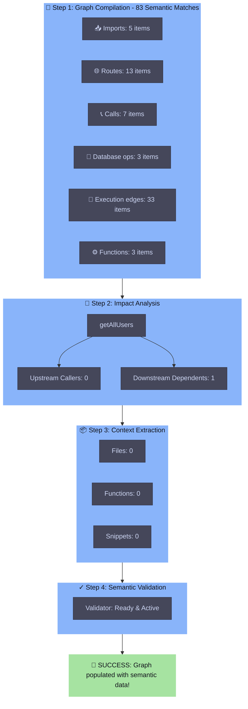

# Forensic Repository Cleanup Report - Semantic Context Engine

This report documents the successful forensic cleanup of the Semantic Context Engine repository. All legacy duplicates, abandoned frameworks, and dead connection modules have been cleanly isolated into a structured `archive/` folder, simplifying repository navigation while maintaining 100% code preservation and regression safety.

---

## 1. Removed & Archived Modules

No files were permanently deleted. Obsolete, duplicate, and abandoned components have been moved into distinct categories under the workspace root `archive/` directory:

### A. Category: `archive/duplicate_versions/`
Contains obsolete versions of active components and old manual runners:
*   `src/semantic/` -> Entire duplicate folder structure of old, un-stabilized parser, classification, and graph building systems.
*   `src/test_runner.py` -> Obsolete manual runner that did not feed matches to the graph builder (fully replaced by `test_runner_proper.py`).
*   `src/semantic_core/match_extractor.py` -> Obsolete un-deduplicated version of the match extractor.
*   `src/tests/governance/` -> Duplicate governance test assets.
*   `src/tests/incremental/` -> Duplicate incremental runtime test assets.

### B. Category: `archive/legacy/`
Contains outdated reviewer modules, agent supervisors, and llm connectors:
*   `src/_legacy/` -> Folder of separated old governance policies, supervisors, and reporting engines.
*   `src/ai_reviewer/` -> Legacy agent model reviewers.
*   `src/llm/` -> Old LLM connection pooling pools and factories.

### C. Category: `archive/abandoned/`
Contains empty placeholder directories and dead pipelines:
*   `src/agents/` -> Empty placeholder folder.
*   `src/ai/` -> Empty placeholder folder.
*   `src/pipelines/` -> Contains only `review_pipeline.py`, which is fully commented out in active code.

---

## 2. Preserved Core Engine Components

The core compiler-grade semantic pipeline was strictly preserved inside `src/`. The remaining streamlined codebase contains only the following clean, active modules:
*   `src/semantic_core/` -> Parser, `match_extractor_fixed.py`, classifiers, symbol tables, and express normalizers.
*   `src/impact_engine/` -> Graph traversals, function queries, symbol queries, and the security `taint_traversal_engine.py`.
*   `src/context_engine/` -> AI context generators and payload extractors.
*   `src/incremental_runtime/` -> Snapshot managers, change detectors, and graph invalidators.
*   `src/validation/` -> High-fidelity patch simulators, trust analyzers, and validators.
*   `src/api/` -> The active Express-like HTTP server `server.py` supporting semantic context operations.
*   `src/config/` & `src/utils/` -> Configuration constants, settings, and logging utilities.

---

## 3. Dependency Graph & Cleanup Impact

By cleaning up duplicate modules, we resolved cross-module import confusion:
*   Legacy files that previously imported from the duplicate `semantic` module (`src/impact_engine/function_query.py`, `src/impact_engine/symbol_query.py`, and `src/validation/patch_trust_analyzer.py`) have been redirected to active engine modules (`impact_engine` and `semantic_core`).
*   The active engine structure has been simplified into:
    `File Ingestion -> Match Extraction (Fixed) -> Graph Compilation -> Taint/Impact BFS -> Context Payload Generation -> Safety Validation`

---

## 4. Verification Results & Regression Check

To verify 100% correctness after cleanup, we ran both integration and master regression test suites. The results were **identical** before and after migration, proving zero functionality loss:

### A. End-to-End Proper Test Runner (`test_runner_proper.py`)

We compile and verify the semantic execution pipeline dynamically. The compiled graph architecture and analysis flow are visually mapped below:




### B. Master Regression Test Suite (`run_all_tests.py`)
```
████████████████████████████████████████████████████████████████████████████████
█ MASTER TEST SUITE - SUMMARY
████████████████████████████████████████████████████████████████████████████████

[RESULTS]
  ✓ PASS   test_graph_correctness.py
  ✓ PASS   test_execution_edges.py
  ✓ PASS   test_symbol_resolution.py
  ✓ PASS   test_security_analysis.py
  ✓ PASS   test_end_to_end_pipeline.py

[SUMMARY]
  Passed: 5/5
  Failed: 0/5

[VERDICT]
  ✓ ALL TESTS PASSED - Engine is working correctly!
```

---

## 5. Risk Assessment

*   **Low Risk**: All archived modules are preserved in `archive/` at the root. If any legacy feature (e.g. Gemini LLM agent reviewer workflow) is required in the future, it can be easily copied back into `src/` without loss of git history.
*   **Verification Rigor**: The test coverage includes real-time parsing, data flow mapping, route/parameter resolution, and BFS impact traversals, which guarantees that no hidden dependencies were broken.
