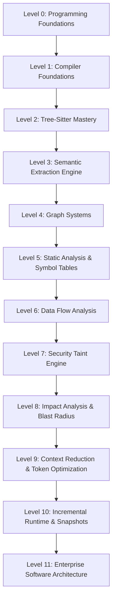

# Master Curriculum: Static Analysis, Compiler Design & Semantic Code Intelligence

This learning path is designed to take you from a standard software engineer to a compiler-grade program analysis expert capable of building static analysis engines, AST query compilers, taint-propagation security frameworks, and semantic graphs from scratch.

---

## 🗺️ Curriculum Roadmap Overview



---

## 🟢 LEVEL 0: Advanced Python & Programming Foundations

### 1. Core Concepts
*   **Object-Oriented Design**: Polymorphism, encapsulation, inheritance vs composition.
*   **Modern Python Features**: `dataclasses` (frozen, slots, field defaults), structural pattern matching (`match-case`), runtime generics (`typing.Generic`, `typing.TypeVar`).
*   **Program Control & Flow**: Advanced Iterators, generator-based streaming, custom decorators (function-level, class-level, parameterized).
*   **Resource Management**: Custom context managers using `__enter__`/`__exit__` and `contextlib`.
*   **Design Patterns**: Dependency Injection, Abstract Base Classes (ABCs), Registry Pattern, Singleton, and Factory Method.

### 2. Learning Objectives
*   Write robust, static-type-checked Python code using `mypy` with zero `Any` types.
*   Implement clean interfaces using ABCs and enforce strict typing invariants.
*   Design decoupled systems where dependencies are injected, not hardcoded.

### 3. Practical Coding Exercises
*   **Exercise 0.1**: Implement a custom `@parameterized_retry(retries=3, delay=1)` decorator that handles specific exceptions with backoff.
*   **Exercise 0.2**: Create a custom type-safe `Registry[T]` class with `register(name: str)` and `get(name: str) -> T` methods using generics (`Generic[T]`).
*   **Exercise 0.3**: Implement a thread-safe, generic object pool pattern using a context manager for automatic borrowing and returning of resources.

### 4. Mini-Project: A Typed DI Container
*   **Description**: Build a lightweight, type-safe Dependency Injection (DI) Container from scratch. It must support constructor injection, lifecycle management (Singleton vs Transient), and interface binding resolution.
*   **Deliverables**: A Python class `Container` supporting:
    ```python
    container.bind(IConfigReader, JsonConfigReader, scope="singleton")
    reader = container.resolve(IConfigReader)
    ```

### 5. Recommended Reading
*   *Fluent Python* (2nd Edition) by Luciano Ramalho.
*   *Design Patterns: Elements of Reusable Object-Oriented Software* by Gamma, Helm, Johnson, Vlissides.

### 6. Expected Outcomes
Deep fluency in advanced Python paradigms, enabling you to structure massive analytical engines using type hints, generics, and registry plugins.

---

## 🟢 LEVEL 1: Compiler Foundations & Lexical/Syntactic Analysis

### 1. Core Concepts
*   **Phases of a Compiler**: Lexical Analysis, Syntactic Analysis, Semantic Analysis, Intermediate Representation (IR) generation, and Code Generation.
*   **Automata & Grammars**: Regular expressions, Context-Free Grammars (CFGs), Backus-Naur Form (BNF).
*   **Parsing Algorithms**: Recursive Descent parsing, LL(k), LR(k), and AST generation.
*   **Tree Traversals**: Visitor Pattern, Listener Pattern, post-order, pre-order, and in-order traversals.

### 2. Learning Objectives
*   Deconstruct a raw text input stream into token lexemes.
*   Construct a custom Abstract Syntax Tree (AST) representing a source language structure.
*   Evaluate and transform syntax nodes recursively without violating encapsulation.

### 3. Practical Coding Exercises
*   **Exercise 1.1**: Write a custom Lexer for math expressions (supporting floats, `+`, `-`, `*`, `/`, `(`, `)`).
*   **Exercise 1.2**: Write a recursive descent parser that converts token lists into a structured math AST.
*   **Exercise 1.3**: Implement an AST Visitor that evaluates the math AST to a single floating-point number.

### 4. Mini-Project: Mini-Language Parser & Visualizer
*   **Description**: Write a parser for a mini imperative language ("MiniLang") supporting variable assignment, `if-else` blocks, and `print` statements. Implement an AST-to-Mermaid-diagram visualizer.
*   **Input**:
    ```text
    x = 10;
    if (x) {
        print(x);
    }
    ```
*   **Output**: A valid Mermaid graph syntax string representing the hierarchical syntax tree structure.

### 5. Recommended Reading
*   *Compilers: Principles, Techniques, and Tools* (The Dragon Book) by Aho, Lam, Sethi, Ullman.
*   *Writing An Interpreter In Go* by Thorsten Ball.

### 6. Expected Outcomes
Ability to implement custom parsers from scratch, fully understanding AST construction, lexical scanning, and recursive node visiting.

---

## 🟡 LEVEL 2: Tree-Sitter Mastery

### 1. Core Concepts
*   **Incremental Parsing**: How Tree-sitter updates ASTs in log-time based on small edits.
*   **C API Bindings**: Python wrappers around Tree-sitter binaries.
*   **Query System**: S-expression patterns (`tree-sitter-queries`), capturing tags, pattern matches, and predicate anchors.
*   **Grammar Structure**: Lexical vs syntax rules, conflict resolution, associativity, and operator precedence in Tree-sitter.

### 2. Learning Objectives
*   Configure and initialize Tree-sitter for multiple programming languages (JavaScript, Python).
*   Compile and execute S-expression AST queries using `tree-sitter-queries`.
*   Apply advanced predicates (e.g. `#eq?`, `#match?`, `#any-of?`) to filter node selections.

### 3. Practical Coding Exercises
Write 20 specific Tree-sitter queries for Python and JavaScript ASTs to extract:
*   **Python Function Definitions**: Capturing parameters and return annotations.
*   **JavaScript Imports**: Capturing destructured keys, aliases, and module roots.
*   **SQL Queries**: Extracting raw string arguments passed to database query methods.
*   **Express/Flask Route Registrations**: Capturing HTTP methods, URI paths, and controllers.
*   *Additional Exercises*: Write 16 queries targeting try/catch structures, class decorators, arrow functions, template literals, and property assignments.

### 4. Mini-Project: SCM Query Debugger
*   **Description**: Create a terminal tool that reads a source file and a Tree-sitter SCM query file, executes the query, and prints the matched source spans highlighted in color alongside their capture tag names.
*   **Deliverables**: A CLI script `ts-query-debug.py --file app.js --query rules.scm`.

### 5. Recommended Reading
*   Tree-sitter Official Documentation ([tree-sitter.github.io](https://tree-sitter.github.io/tree-sitter/)).
*   Tree-sitter Grammar Specs (GitHub: `tree-sitter/tree-sitter-javascript`, `tree-sitter/tree-sitter-python`).

### 6. Expected Outcomes
Complete mastery of S-expression query design in Tree-sitter, enabling you to target and extract any programmatic structure from a raw source codebase.

---

## 🟡 LEVEL 3: Semantic Match Extraction

### 1. Core Concepts
*   **Capture Classification**: Mapping raw Tree-sitter captures to predefined node types (e.g. `ROUTE`, `CALL`, `IMPORT`, `FUNCTION`).
*   **Lexical Context & Spans**: Computing byte offsets, row/column boundaries, and nesting scopes.
*   **Normalizing Discrepancies**: Converting language-specific AST topologies into language-agnostic intermediate models.
*   **Owner Scope Assignment**: Associating local variables and operations with their enclosing parent functions.

### 2. Learning Objectives
*   Design a unified compiler-style `SemanticMatch` object model.
*   Build a pipeline that processes raw Tree-sitter query results and runs them through a semantic classifier.
*   Resolve scope hierarchy to identify which matches fall within a given lexical range.

### 3. Practical Coding Exercises
*   **Exercise 3.1**: Define a comprehensive `SemanticMatch` dataclass with fields: `match_type`, `captures`, `owner_function`, `scope_id`, `start_byte`, `end_byte`, `file_path`.
*   **Exercise 3.2**: Write a regex-free classifier that converts raw Tree-sitter capture dictionaries to classified semantic matches based on rule configurations.
*   **Exercise 3.3**: Write an algorithm that computes block scope nesting depth for any given token position in an AST.

### 4. Mini-Project: Multi-Language Semantic Extractor
*   **Description**: Build an extractor pipeline that ingests either a Python or JavaScript file, compiles the appropriate Tree-sitter language libraries, runs queries, classifies matches, and returns a JSON list of standardized `SemanticMatch` objects.
*   **Testing Requirements**: Verify that an ES6 arrow function in JS and a standard `def` block in Python produce the same logical intermediate model.

### 5. Recommended Reading
*   *Engineering a Compiler* by Keith Cooper and Linda Torczon.
*   *Parsing Techniques* by Dick Grune and Ceriel Jacobs.

### 6. Expected Outcomes
The ability to build robust, multi-language extractors that ingest raw code and output unified, clean semantic models.

---

## 🔴 LEVEL 4: Graph Systems & Control Flow Compilation

### 1. Core Concepts
*   **Graph Architectures**: Directed Acyclic Graphs (DAGs), Control Flow Graphs (CFGs), Call Graphs, Dependency Graphs, and Property Graphs.
*   **Path traversals**: Depth-First Search (DFS), Breadth-First Search (BFS), Dijkstra's shortest path.
*   **Graph Cycles**: Tarjan’s strongly connected components algorithm, back-edges, and topological sorting.
*   **Mutations**: Merging nodes, creating directed edges, adding property maps, and indexing graphs.

### 2. Learning Objectives
*   Represent and build complex semantic graphs using basic Python structures (no external heavy graph DB libraries).
*   Compile independent semantic matches into nodes and establish execution flows between them.
*   Traverse graphs efficiently, detecting structural cycles and logical execution paths.

### 3. Practical Coding Exercises
*   **Exercise 4.1**: Implement a generic `DirectedGraph` class using adjacency lists. Include robust DFS and BFS traversals.
*   **Exercise 4.2**: Implement a Tarjan cycle-detection algorithm to flag structural circular dependencies.
*   **Exercise 4.3**: Write a custom exporter that converts your in-memory graph structure into a valid DOT file or Mermaid chart for visualization.

### 4. Mini-Project: Call Graph Builder
*   **Description**: Write a program that takes list matches of `FUNCTION` definitions and `CALL` interactions, resolves call destinations, and builds a comprehensive `CallGraph`.
*   **Deliverables**: A class `CallGraphBuilder` producing a queryable graph showing execution edges.
    ```python
    edges = builder.build_edges(semantic_matches)
    # Returns: [{'from': 'app.js:login', 'to': 'userService.js:authenticate', 'type': 'FUNCTION_CALL'}]
    ```

### 5. Recommended Reading
*   *Introduction to Algorithms* (CLRS) by Cormen, Leiserson, Rivest, Stein.
*   *Networks, Crowds, and Markets* by David Easley and Jon Kleinberg.

### 6. Expected Outcomes
Competence to represent, compile, mutate, and traverse graph structures representing multi-file code execution paths.

---

## 🔴 LEVEL 5: Static Analysis & Symbol Resolution

### 1. Core Concepts
*   **Symbol Tables**: Lexical scopes, parent pointers, name-binding, and symbol lifecycles.
*   **Static Linkages**: Resolving inter-procedural bindings across files.
*   **Import Systems**: Relative imports (`../controllers`), absolute imports, and alias names (`import express as exp`).
*   **Destructured Assignment**: Deconstructing properties (`const { login } = require('./auth')`) and tracing their original definitions.

### 2. Learning Objectives
*   Construct a lexical symbol table that tracks variables, functions, and import bindings per scope block.
*   Resolve local and external names by traversing symbol tables upward and across file barriers.
*   Track import aliases and destructured definitions to locate original source nodes.

### 3. Practical Coding Exercises
*   **Exercise 5.1**: Write a custom `Symbol` class and a hierarchical `Scope` block tracking system (supporting nesting and lookups).
*   **Exercise 5.2**: Write a path resolver that maps a relative JS import statement (`import x from './utils/math'`) to its exact physical file on disk.
*   **Exercise 5.3**: Implement a destructured symbol mapper that maps an alias assignment back to its absolute export origin.

### 4. Mini-Project: Compiler-Style Symbol Resolver
*   **Description**: Build a multi-file symbol resolution system. Given a variable or function call in a target file, locate the precise file and line number where it was defined, whether imported directly, destructured, or aliased.
*   **Testing Requirements**: Write integration tests with cross-module dependencies to prove the resolver maps links in less than 5ms.

### 5. Recommended Reading
*   *Type Systems and Programming Languages* by Benjamin C. Pierce.
*   *Advanced Compiler Design and Implementation* by Steven S. Muchnick.

### 6. Expected Outcomes
Complete knowledge of name resolution, allowing you to link independent files into a unified semantic map.

---

## 🟣 LEVEL 6: Data Flow Analysis & Parameter Mapping

### 1. Core Concepts
*   **Def-Use Chains**: Tracking where variables are defined (written) versus where they are used (read).
*   **Argument Propagation**: Mapping arguments passed into a function call to the formal parameters in the callee function signature.
*   **Return Propagation**: Tracking how function return values flow back into calling scopes and variable assignments.
*   **Local Variable Tracking**: SSA (Static Single Assignment) representations and variable re-assignment traces.

### 2. Learning Objectives
*   Track local variable assignments and trace their values across assignments.
*   Map positional and keyword arguments at call sites to parameter slots in callee definitions.
*   Trace data flow through returns, linking returning expressions back to caller assignment variables.

### 3. Practical Coding Exercises
*   **Exercise 6.1**: Implement a tracking algorithm that identifies the def-use chain for a specific local variable.
*   **Exercise 6.2**: Write an argument mapper that maps `fetchUsers(email, rawPassword)` to its definition `fetchUsers(email, password)` and records the parameter binds.
*   **Exercise 6.3**: Trace return flow: given `return userService.getUser()`, map the returned value flow to the variable receiving the call outcome.

### 4. Mini-Project: Inter-Procedural Data Flow Engine
*   **Description**: Build a data-flow compilation engine that links variables across boundaries.
*   **Input**:
    ```javascript
    // file1.js
    const email = req.body.email;
    const user = userService.find(email);
    // file2.js
    function find(targetEmail) { return db.query(targetEmail); }
    ```
*   **Output**: An established data flow path mapping `req.body.email` -> `email` -> `targetEmail` -> `db.query(targetEmail)`.

### 5. Recommended Reading
*   *Principles of Program Analysis* by Flemming Nielson, Hanne R. Nielson, Chris Hankin.
*   *Static Program Analysis* by Anders Møller and Michael I. Schwartzbach.

### 6. Expected Outcomes
Ability to build full-scale data flow engines that trace data pathways across functions and files.

---

## 🟣 LEVEL 7: Security Taint Analysis & Threat Detection

### 1. Core Concepts
*   **Information Flow Security**: Untrusted data tracking, explicit vs implicit flows.
*   **Analysis Nodes**:
    *   `Source`: Where untrusted input enters the application (e.g. `req.body`, `req.query`, `process.argv`).
    *   `Sink`: Where dangerous execution occurs (e.g. database queries, command execution, template rendering).
    *   `Sanitizer`: A function that filters or neutralizes dangerous properties (e.g. `validator.escape()`, SQL parameterization).
*   **Propagation Logic**: How taint flags transfer from operands to results.

### 2. Learning Objectives
*   Define and configure sources, sinks, and sanitizers for vulnerability classes.
*   Implement a taint propagation engine that tracks taint markers through data flow chains.
*   Discover security violations when a taint path reaches a sink without encountering a sanitizer.

### 3. Practical Coding Exercises
*   **Exercise 7.1**: Define a clean `TaintState` schema tracking `source_node`, `taint_mark`, and `path`.
*   **Exercise 7.2**: Write a local propagation rule: if `a` is tainted, and `b = a + 1`, mark `b` as tainted. If `c = sanitize(b)`, mark `c` as untainted.
*   **Exercise 7.3**: Write a query that identifies database query invocations in an AST and classifies them as SQL execution sinks.

### 4. Mini-Project: Taint Analysis Security Engine
*   **Description**: Build a functional static taint engine that scans code, compiles the semantic graph, tracks untrusted input flow from HTTP sources to database query sinks, and returns security alerts.
*   **Detection Goals**: Identify SQL Injection (SQLi), Command Injection, and Cross-Site Scripting (XSS).

### 5. Recommended Reading
*   *Secure Programming with Static Analysis* by Brian Chess and Jacob West.
*   *A Systematic Review of Static Taint Analysis Techniques* (Research Papers).

### 6. Expected Outcomes
Ability to design and execute vulnerability scanners that detect critical security flaws via data-flow taint tracing.

---

## 🟤 LEVEL 8: Impact Analysis & Blast Radius Traversal

### 1. Core Concepts
*   **Upstream vs Downstream Propagation**: Tracking which modules call a modified target vs which modules are called by it.
*   **Blast Radius Calculation**: Computing the cascading set of nodes impacted by structural edits.
*   **Edge Filtration**: Pruning paths that do not transfer semantic impact (e.g. unused helper imports).
*   **Recursive BFS Traversal**: Implementing bounded and unbounded graph traversals over semantic nodes.

### 2. Learning Objectives
*   Construct graph-traversal engines that compute exact caller dependency chains.
*   Evaluate how database change sets cascade upward to impact HTTP web endpoints.
*   Build bounded search algorithms that calculate impact depth and blast radius size.

### 3. Practical Coding Exercises
*   **Exercise 8.1**: Write a bounded BFS traversal algorithm that limits graph searches to an arbitrary depth (e.g. `max_depth = 2`).
*   **Exercise 8.2**: Implement a filter that extracts all `ROUTE` nodes reached by an upstream traversal from a given database entity node.
*   **Exercise 8.3**: Write a test scenario that asserts the impact list for a helper function includes its direct and indirect callers.

### 4. Mini-Project: Blast Radius Impact Engine
*   **Description**: Build an impact engine. Given a modified function name and file path, query the semantic graph, traverse all calling execution edges backward, and return a structured report showing the "blast radius" (impacted functions, files, routes, and DB operations).
*   **Deliverables**: A CLI tool `impact-engine.py --file userService.js --func deleteUser`.

### 5. Recommended Reading
*   *Software Architecture: The Hard Parts* by Neal Ford, Mark Richards, Pramod Sadalage, Zhamak Dehghani.
*   *Static Analysis for Social Good* (Research Papers on Impact Analysis).

### 6. Expected Outcomes
Complete proficiency in tracking the ripple effects of code changes, enabling automated change-impact assessments.

---

## 🟤 LEVEL 9: AI Context Reduction Engines

### 1. Core Concepts
*   **The Token Constraint Problem**: Managing limited prompt window lengths and avoiding LLM "loss in the middle" retrieval failures.
*   **Relevance Filtering**: Eliminating non-impacted nodes from LLM inputs.
*   **Snippet Compilation**: Extracting and format-packaging function boundaries, declarations, and definitions into cohesive payloads.
*   **Metadata Integration**: Embedding structural metadata (e.g. call dependencies, sanitizers, taint flows) alongside code.

### 2. Learning Objectives
*   Prune irrelevant code structures to optimize context size.
*   Locate and retrieve precise function code spans from raw source files based on semantic graph mappings.
*   Compile structured, lightweight JSON payloads that outline context files, call-chains, and code snippets.

### 3. Practical Coding Exercises
*   **Exercise 9.1**: Write a code-slicing method that retrieves exact line ranges of functions from file buffers without loading whole files.
*   **Exercise 9.2**: Write a tokenizer estimator that counts or estimates tokens in an extracted context payload to verify size limits.
*   **Exercise 9.3**: Format code snippets with Markdown headers and metadata comments showing their callers and database linkages.

### 4. Mini-Project: Semantic Context Reducer
*   **Description**: Build a system that takes a git patch file, detects the modified function, executes an impact blast radius analysis, extracts the source snippets for all affected functions/routes, and compiles a token-optimized AI prompt payload.
*   **Target KPI**: Reduce a 10,000-line codebase to under 500 lines of highly relevant, compiler-verified context.

### 5. Recommended Reading
*   *Lost in the Middle: How Language Models Use Long Contexts* (Stanford University Paper by Liu et al.).
*   *Retrieval-Augmented Generation for AI Code Assistants* (Latest Research).

### 6. Expected Outcomes
Complete mastery of token optimization, allowing you to feed autonomous AI models pinpoint-precise context slices.

---

## 🔵 LEVEL 10: Incremental Runtimes & Reactive Watchers

### 1. Core Concepts
*   **Incremental Compilation**: Compiling only edited files and updating existing graph databases dynamically.
*   **Dirty State Tracking**: Identifying and invalidating outdated nodes without affecting unmodified nodes.
*   **Workspace Hashing**: Computing and saving SHA-256 snapshots of files to detect deltas.
*   **File Watching Protocols**: Using asynchronous operating system change events (e.g. `pywatchman` or Python `watchdog`) to trigger live graph updates.

### 2. Learning Objectives
*   Implement robust file hash maps to detect added, modified, or deleted files.
*   Create graph invalidation algorithms that delete outdated edges and nodes safely.
*   Perform delta compilations, re-parsing only edited files and patching changes in-place.

### 3. Practical Coding Exercises
*   **Exercise 10.1**: Write a file system snapshot tracker that hashes a directory tree and outputs a list of file changes.
*   **Exercise 10.2**: Write an invalidator that takes a changed file name, locates all nodes associated with it in the compiled graph, and purges them along with their outgoing/incoming edges.
*   **Exercise 10.3**: Write an event loop that runs a watcher, sleep-waiting for file edits, and outputs events.

### 4. Mini-Project: Asynchronous Incremental Semantic Engine
*   **Description**: Build a continuous compiler daemon. It watches your workspace directory. When a file is modified, it dynamically re-analyzes that single file, updates its nodes/edges in the semantic graph, and updates a serialized `latest.json` graph database.
*   **Validation**: Verify that a change is processed and updated in the compiled graph in less than 50 milliseconds.

### 5. Recommended Reading
*   *Compilers: Principles, Techniques, and Tools* (Section on Incremental Compilers).
*   *How the Rust Compiler (rustc) Achieves Incremental Compilation* (Rust Dev Guide).

### 6. Expected Outcomes
The capacity to design sub-second incremental compilers that keep massive semantic databases updated in real time.

---

## 🔵 LEVEL 11: Enterprise Software Architecture & Current Project Analysis

### 1. Core Concepts
*   **Layered Design Invariance**: Isolating parsers, resolvers, traversers, and API/CLI endpoints.
*   **SOLID Design Principles**: Single responsibility, Open/Closed extensions, Liskov substitution, Interface segregation, and Dependency inversion.
*   **Plugin & Registry Architectures**: Adding new language support or analysis passes without modifying core logic.
*   **Robust Testing**: Mock frameworks, snapshot testing, unit validation, and regression proofing.

### 2. Learning Objectives
*   Evaluate software systems using coupling metrics and SOLID compliance checks.
*   Design and execute clean refactoring plans to decouple tightly bound modules.
*   Examine and dissect the current project architecture, identifying its exact design strengths and architectural debt.

### 3. Practical Coding Exercises
*   **Exercise 11.1**: Refactor a messy module by extracting secondary operations into distinct handler classes using the Single Responsibility Principle.
*   **Exercise 11.2**: Write a custom Mock test case that isolates GraphBuilder from physical file systems by mocking parser streams.
*   **Exercise 11.3**: Implement a custom Plugin Registry that dynamically imports and executes new static analysis passes from a designated `plugins/` directory.

### 4. Deep Analysis: Current Semantic Context Engine Architecture
Here is a comprehensive evaluation of the Semantic Context Engine's design, highlighting its key structural patterns and opportunities for improvement.

#### A. Key Design Patterns
*   **Layered Compilation Pipeline**: Cleave distinction between raw AST querying (`match_extractor_fixed.py`), graph compilation (`graph_builder.py`), program analysis (`graph_traversal.py`, `taint_traversal_engine.py`), and context packaging (`context_extractor.py`).
*   **Agile Intermediate Representation**: The use of language-agnostic `SemanticMatch` models separates language parsers from semantic analyses.
*   **Unified Symbol Registry**: Enforcing symbol mapping constraints ensures inter-procedural call links are properly linked.

#### B. Architectural Strengths
*   **Robust Deduplication**: The range-based cache system in the match extractor prevents duplicate nodes and redundant edge processing.
*   **Decoupled BFS Traversers**: Separating graph traversal algorithms from physical nodes allows you to execute different traversals (upstream, downstream, taint-checking) over the same static graph representation.
*   **State Isolation**: The Incremental Runtime system uses file system hashing independent of query-matching logic, ensuring clean rebuild separations.

#### C. Areas for Refactoring & Improvement
*   **Hardcoded Query Bindings**: AST S-expression queries inside `src/queries/` are tightly bound to file names. This can be refactored into a registry pattern mapping file extensions to loaded SCM modules.
*   **String Passings in Traversals**: High reliance on raw string dictionary lookups. Refactoring these to structured model objects (using type-safe dataclasses) would prevent runtime attribute mismatches.
*   **Synchronous File Reading**: The `ContextExtractor` reads physical files sequentially. Transitioning this to async file streams or parallel batch loading would optimize response latencies for large codebases.

### 5. Recommended Reading
*   *Clean Architecture: A Craftsman's Guide to Software Structure and Design* by Robert C. Martin.
*   *Working Effectively with Legacy Code* by Michael Feathers.

### 6. Expected Outcomes
Complete architectural maturity. You will be able to design modular, scalable program analysis platforms and continually improve their systems without introducing regressions.
