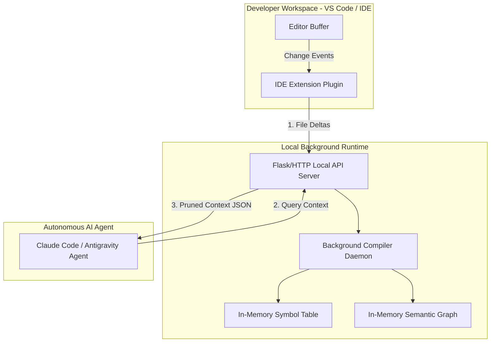
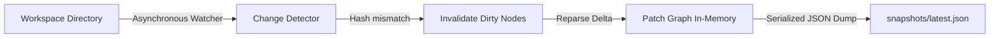

Viewed DIAGRAM_VALIDATION_REPORT.md:1-22

# Architectural Analysis & Real-World Integration Review: Semantic Context Engine

---

## 1. Trigger Strategy Analysis

Integrating static analysis into a real-time developer loop requires balancing **completeness** with **latency**. Below is a detailed engineering trade-off matrix for each triggering model.

| Trigger model | Pros | Cons | Performance Impact | Developer Experience |
| :--- | :--- | :--- | :--- | :--- |
| **Every Keystroke** | Instantaneous feedback; editor shows active linting or security taints instantly. | CPU exhaustion; parser thrashing; high rate of incomplete ASTs (syntax errors) during active typing. | **Extreme** (10-100 parses/sec). Exhausts laptop thermal/CPU cycles. | **Poor**: Distracting "flicker" of validation errors while actively writing incomplete statements. |
| **File Save** | Code is usually syntactically complete; clear, predictable developer checkpoint. | Latency introduced; requires developers to change habits to trigger updates manually. | **Low-Medium** (Bounded to save events; typically once every few minutes). | **Excellent**: Invisible, quiet background synchronization with zero thrashing. |
| **Git Diff** | Minimal work; only parses and recompiles files actively modified in the commit list. | Blind to changes made prior to staging; doesn't update the graph for uncommitted local workspace edits. | **Very Low** (Once per git command invocation). | **Good**: Useful for pre-commit checks or pull request gates, but insufficient for interactive IDE coding. |
| **Test Execution** | Extremely safe; guarantees the graph updates when code behavior is evaluated. | Too slow; runs late in the loop; feedback is not interactive. | **Low** (Tied to test suite runs). | **Neutral**: Helpful for CI/CD gates, but useless for active development assistance. |
| **App Startup** | Simplifies initialization; maps out the initial full-repository state. | Doesn't capture ongoing runtime edits; graph goes stale immediately. | **One-time High** (Processes the entire repository at startup). | **Good at boot**, but degrades to uselessness as soon as edits occur. |
| **Build Time** | Integrated with standard bundlers (webpack, vite); guarantees exact build alignments. | Restriced to build execution; high compilation latency. | **High** (Runs during compilation passes). | **Poor**: Slows down the bundler loops. |
| **On Demand (AI Ask)** | Lazily computes graph updates only when the developer asks the AI a question. | High initial question latency; AI has to wait for re-parsing before returning answers. | **Burst High** (Triggered dynamically on prompt invocation). | **Poor**: Delays AI agent responsiveness. |

### 🏆 Recommended Production Approach: Hybrid Save & Idle Debounce
The best production approach is a **Save-Triggered, Idle-Debounce Hybrid**:
1.  **Primary Trigger**: Trigger compilation immediately upon **File Save** (`Ctrl+S`).
2.  **Secondary Trigger**: An **Idle Debounce** watcher triggers if the developer stops typing for `2 seconds` without saving.
3.  **Parser Tolerance**: The parser uses Tree-sitter's error recovery node tracking to cleanly isolate incomplete syntax constructs, avoiding graph compiler crashes during active typing blocks.

---

## 2. Runtime Architecture

The runtime architecture determines how the analysis process runs and communicates with the system host.



### Trade-offs of Architectural Models
*   **Background Daemon / Local Service**:
    *   *Trade-off*: Runs a low-overhead, in-memory Python process. Keeps the compiled graph, symbol registry, and indexes in memory for sub-millisecond BFS traversals.
    *   *Verdict*: **Highly Recommended**. Excellent performance; isolates parser libraries from node/V8 runtime blocks.
*   **VSCode Extension / IDE Plugin**:
    *   *Trade-off*: Porting a massive, CPU-bound Python program analyzer directly to Node.js/Typescript is extremely complex, or spawning Python subprocesses continuously introduces high launch latency.
    *   *Verdict*: **Partially Recommended**. Use a thin Typescript VSCode Extension *only* as a file change forwarder and UI client that communicates with the local Python daemon.
*   **CLI Process**:
    *   *Trade-off*: Simple to build, but cold startup cost is high. The parser must walk, parse, and rebuild the entire graph from scratch on every invocation, taking several seconds.
    *   *Verdict*: Useful for CI/CD pipelines, but unusable for interactive development.

### 🏆 Recommended Production Architecture: Thin IDE Forwarder + Persistent Python Local Daemon
Run a persistent local Python service (`background daemon`) exposing a lightweight loopback API server (`localhost:4242`). A thin IDE plugin hooks into file-save events and posts the modified file paths to the local daemon, which invalidates the nodes and updates the in-memory graph instantly.

---

## 3. Snapshot Strategy

Maintaining a queryable graph across daily workspace sessions requires a fast, persistent snapshot strategy.



### 1. Graph Persistence
*   The system should serialize the in-memory graph representation to a structured, binary-mapped format (such as MessagePack) rather than standard JSON. MessagePack minimizes serialization overhead and disk footprints by up to 60%.
*   On daemon launch, it reads the serialized graph from `snapshots/latest.gdb` in under `50ms`.

### 2. Cache Invalidation & Incremental Updates
*   **SHA-256 Hashing**: Keep a persistent dictionary of file path keys mapped to their SHA-256 hashes (`{"src/api/auth.js": "7a3b4c..."}`).
*   **Change Detection**: When the background daemon receives an event, it computes the hash of the modified file. If it differs from the snapshot record, it flags the file as **dirty**.
*   **Dynamic Purge**: The `GraphInvalidator` traverses the in-memory graph, purges only the nodes owned by the dirty file path, and drops all incoming and outgoing execution edges (`ROUTE_CALL`, `FUNCTION_CALL`, `DB_ACCESS`) linked to those nodes.
*   **Delta Compilation**: Only the dirty file is re-parsed by Tree-sitter. The compiled semantic matches are stitched into the stable graph, and inter-file data flow linkages are recompiled dynamically in under `20ms`.

---

## 4. Full-Stack Application Example

Assume you have a full-stack workspace: React (Frontend) ➔ Express (Backend) ➔ PostgreSQL (Database). You modify `userService.js` on the backend.

### 🏁 Step-by-Step Execution Lifecycle

#### Step 1: Change Detection
1.  You save `userService.js` (e.g. changing `fetchUsers(email)` to use dynamic variable queries).
2.  The background watcher detects the event, compares the file hash, and flags `userService.js` as dirty.

#### Step 2: Graph Invalidation
1.  All functions defined in `userService.js` (such as `fetchUsers`, `deleteUser`) are deleted from the `FunctionIndex`.
2.  All execution edges leading *to* `userService.js` or originating *from* `userService.js` are purged from the graph.
3.  All local variable states and data flow records mapped to `userService.js` are cleared.

#### Step 3: Delta Parsing & Ingestion
1.  Tree-sitter parses the new `userService.js` AST.
2.  SCM queries capture definitions, parameters, calls, and database transactions.
3.  Matches are classified and ingested:
    *   `fetchUsers` is registered as a function.
    *   Its parameters (`email`, `password`) are recorded.
    *   A database transaction query (`db.query`) is classified as a database operation.
4.  The symbol table maps internal dependencies.

#### Step 4: Edge Stitching & Linkage
1.  **Caller linkage**: The `GraphBuilder` scans for external calls pointing to `userService.js` (e.g. `userController.js` calling `userService.fetchUsers`). It re-establishes the `FUNCTION_CALL` execution edge.
2.  **Database linkage**: An execution edge is compiled linking the function `fetchUsers` to the `DATABASE` entity representing PostgreSQL.
3.  **Data Flow Mapping**: Formal parameters are mapped positionally. A data flow edge is drawn from `userController.js`'s call argument `safeEmail` to `fetchUsers`'s parameter `email`.

#### Step 5: Real-time Traversal & Blast Radius Calculation
1.  The developer launches an AI session to review the change.
2.  The engine runs a **backward BFS traversal** from the edited `fetchUsers` node:
    *   Finds caller `userController.getAllUsers`.
    *   Finds caller `ROUTE` node `GET /users`.
3.  The engine runs a **forward BFS traversal**:
    *   Finds downstream `db.query` PostgreSQL sink.
4.  The complete blast radius (1 route, 2 functions, 1 database sink) is computed instantly.

---

## 5. AI Integration Flow

A clean request/response flow ensures the AI assistant receives pinpoint context without exposing proprietary directories or overloading the context window.

### 📤 What Data to Send (High Value)
*   **The Blast Radius Code Snippets**: Only the line-padded code contents of functions/routes directly affected by the change.
*   **Linkage Maps**: Execution chains showing exactly how the route flows to the modified function and database.
*   **Security Metadata**: Active taints or vulnerabilities mapped along the active call path.

### ⛔ What Data to Never Send (Security & Privacy)
*   **Unmodified Files**: Discard whole files outside the blast radius to prevent context poisoning.
*   **Proprietary Environment/Secrets**: Filter out `.env` contents, API credentials, or certificates.
*   **Non-Source Assets**: Exclude massive database dumps, binary assets, and media directories.

### 🔄 Request / Response Interaction Pattern

```
IDE Extension                  Python Daemon
     │                               │
     │─── 1. POST /analyze/impact ──>│
     │    (file, diff, context)      │
     │                               │
     │<── 2. RESPONSE (JSON) ────────│
     │    (Blast Radius, Snippets,   │
     │     Taint Alerts)             │
     │                               │
```

#### 1. Request Payload (IDE Extension ➔ Python Daemon)
```json
{
  "project_path": "c:/app/token_reducer_system",
  "edited_file": "test_microservice/controllers/userController.js",
  "change_diff": "@@ -15,4 +15,5 @@\n- const rawPassword = req.body.password;\n+ const rawPassword = req.body.pass;",
  "edited_function": "getAllUsers",
  "max_token_budget": 2048
}
```

#### 2. Response Payload (Python Daemon ➔ IDE Extension/AI Prompt)
```json
{
  "status": "success",
  "blast_radius": {
    "impact_depth": 2,
    "affected_routes": [
      {"route": "/users", "method": "POST", "file": "test_routes/api.js"}
    ],
    "affected_functions": [
      {"function": "getAllUsers", "file": "controllers/userController.js"},
      {"function": "fetchUsers", "file": "services/userService.js"}
    ],
    "vulnerabilities_detected": [
      {
        "type": "SQL_INJECTION",
        "severity": "HIGH",
        "source": "req.body.password",
        "sink": "db.query",
        "path": "getAllUsers -> fetchUsers -> db.query"
      }
    ]
  },
  "prompt_context": {
    "files": ["controllers/userController.js", "services/userService.js"],
    "snippets": [
      {
        "file": "controllers/userController.js",
        "function": "getAllUsers",
        "content": "function getAllUsers(req, res) {\n    const safeEmail = req.body.email;\n    const rawPassword = req.body.password;\n    userService.fetchUsers(safeEmail, rawPassword);\n}"
      }
    ]
  }
}
```

---

## 6. Context Packaging

The ideal structure for the prompt injection payload must be compact, strongly structured, and visually clean.

```markdown
# SEMANTIC ANALYSIS CONTEXT PAYLOAD
---
## 1. Blast Radius Map
The modified function `userService.fetchUsers` impacts the following execution paths:
- ROUTE: POST `/users` (test_routes/api.js) -> calls `userController.getAllUsers`
- FUNCTION: `userController.getAllUsers` -> calls `userService.fetchUsers`
- DATABASE: PostgreSQL `User` Model find operation

---
## 2. Active Security Findings
[WARNING] SQL_INJECTION detected:
- Source: `req.body.password` inside `userController.js`
- Sink: `User.find` inside `userService.js`
- Path: `getAllUsers` -> `fetchUsers` -> `User.find` (un-sanitized!)

---
## 3. High-Relevance Code Snippets
### File: `controllers/userController.js` (lines 10-25)
```javascript
function getAllUsers(req, res) {
    const safeEmail = req.body.email;
    const rawPassword = req.body.password;
    userService.fetchUsers(safeEmail, rawPassword);
}
```

### File: `services/userService.js` (lines 5-18)
```javascript
export function fetchUsers(email, password) {
    // VULNERABLE: Direct string interpolation without parameterized queries
    db.query(`SELECT * FROM users WHERE email = '${email}' AND password = '${password}'`);
}
```


## 7. Developer Workflow Lifecycle

```
Developer Workspace            Local Compiler Daemon         AI Coding Assistant
        │                                │                            │
        │─── 1. Save (Ctrl+S) ──────────>│                            │
        │                                │                            │
        │                                │─── 2. Delta rebuild ──────>│
        │                                │    (Invalidate & Stitch)   │
        │                                │                            │
        │─── 3. Ask AI / Run Agent ──────────────────────────────────>│
        │                                                             │
        │                                <─── 4. Pull local context ──│
        │                                     (Blast radius data)     │
        │                                                             │
        │                                ─── 5. Return JSON payload ─>│
        │                                                             │
        │<── 6. Return precise answer ────────────────────────────────│
        │    (No code bloat!)                                         │

```

1.  **Developer Action**: Developer writes code and saves the file (`Ctrl+S`).
2.  **Incremental Analysis**: The local compiler daemon captures the save event, matches deltas, purges dirty nodes, re-runs Tree-sitter on the single modified file, and updates the in-memory graph in `<50ms`.
3.  **Prompt Invocation**: The developer triggers the AI agent (e.g. asking "Review my changes for security issues" or "Add a parameter to this call").
4.  **Local Context Extraction**: The AI agent queries the local daemon (`/analyze/impact`). The daemon executes BFS traversals, collects line-padded source snippets inside the blast radius, and compiles a token-reduced payload.
5.  **LLM Execution**: The AI agent sends the pinpoint-precise context payload to the LLM.
6.  **Optimal Reasoning**: The LLM processes the highly focused context, returns the correct response instantly, and avoids token window exhaustion.

---

## 8. Scaling Concerns

Scaling program analysis requires adjusting core algorithms to match codebase scale.

### 1. Small to Medium Projects (< 100,000 LOC)
*   *Design*: In-memory graph compilation using direct Python dict tables is extremely fast and sufficient. Full compiles take `<500ms`, and delta updates run in `10ms`.

### 2. Large Monorepos (100,000 - 1,000,000 LOC)
*   *Design Changes*:
    *   **Shared Symbol Cache**: Storing every module's symbol indices inside an in-memory database like SQLite or Redis prevents memory bloat.
    *   **Subproject Isolation**: Boundary rules divide the graph. Monorepo subprojects are parsed as independent dependency subgraphs, traversing boundaries only across explicit package references (`package.json` linkages).

### 3. Enterprise Codebases (> 5,000,000 LOC)
*   *Design Changes*:
    *   **Distributed compilation / Remote indexing**: Central CI/CD pipelines compile semantic indexes at night and save them to a shared database. Developers download pre-built global indexes, and the local daemon only parses local files.
    *   **Bounded Traversal Depth**: Strict limits prevent unbounded recursive BFS sweeps. Impact traversals cap at a maximum depth of `3 levels` to prevent performance degradation on highly central utility libraries.

---

## 9. Current Architectural Gaps

Dissecting the current repository reveals the following gaps that must be resolved before production deployment:

### 1. Rigid Language Binding Assumptions
*   *Gap*: AST queries in `src/queries/` and compilers in `src/semantic_core/` assume strict JavaScript/TypeScript semantics (e.g., CommonJS `require` or ES6 `import`).
*   *Impact*: Adding Python or Go parsing causes failures in `graph_builder.py` due to mismatched variable assignment syntax and call-chain resolutions.

### 2. Positional-Only Parameter Joins
*   *Gap*: The data flow engine (`build_argument_parameter_flow`) relies on strict positional index joins (`arg[i] ➔ param[i]`).
*   *Impact*: If code uses named keyword arguments (Python `func(name=val)`) or destructured Javascript parameter objects (JS `func({ email, password })`), the data-flow connections will fail or map incorrectly.

### 3. Static Type Ignorance
*   *Gap*: The engine uses simple string matching for symbol lookup rather than deep type evaluation.
*   *Impact*: If two classes in different modules define the same method name (e.g. `User.find()` and `Product.find()`), the resolver might create erroneous execution edges because it cannot differentiate object types statically.

### 4. Dynamic Import Blind Spot
*   *Gap*: The resolver assumes module imports can be statically traced via string path definitions.
*   *Impact*: Dynamic code structures (such as Node.js `require(variable)` or dynamic python imports) will fail to resolve, creating isolated island nodes in the graph.

---

## 10. Unified Production Recommendation

For a robust, production-grade static analysis platform designed to accelerate vibe coding and power autonomous AI agents, the following unified architecture is recommended:

```
                  ┌──────────────────────────────────────────────┐
                  │          Local Persistence Database          │
                  │             (MessagePack Cache)              │
                  └──────────────────────┬───────────────────────┘
                                         │  Read/Write
                                         ▼
┌──────────────────┐  File Save   ┌──────────────┐  Local HTTP   ┌──────────────────┐
│  VS Code Plugin  ├─────────────>│ Persistent   ├──────────────>│  Claude Code /   │
│  (IDE Extension) │  OS Watch   │ Python Daemon│  JSON API     │  Antigravity IDE │
└──────────────────┘  Events      └──────┬───────┘               └──────────────────┘
                                         │  Parse
                                         ▼
                                  ┌──────────────┐
                                  │ Tree-sitter  │
                                  │ Query Engine │
                                  └──────────────┘
```

### 1. Persistent Daemon Runtime
*   Run a persistent background daemon written in Python that auto-starts on IDE initialization.
*   The daemon exposes a lightweight `localhost` HTTP endpoint.
*   Stores the compiled semantic graph in-memory using highly optimized C-implemented database tables (via Cython or PyPy compatibility) to ensure sub-millisecond graph query latencies.

### 2. Live Incremental Watcher
*   Integrate direct operating system file-system notifications (e.g. using `watchdog`) to listen to active workspace modifications.
*   On file save, trigger an **incremental invalidation** pass: purge the file's old node footprints from memory, re-run Tree-sitter on the changed file, and dynamically re-stitch execution edges in under `30ms` with zero full-project crawls.

### 3. Dual-Level Graph Architecture
*   Compile both a **Global Call/Import Graph** (to track inter-procedural route dependencies) and a **Local Data Flow Graph** (to map variable parameters and sanitizers).
*   Separate AST pattern queries into modular, directory-loaded SCM plugins. This enables adding new programming languages by placing SCM query files into a plugins folder.

### 4. Context Packaging & Prompt Injection
*   Expose a secure API route (`/prompt/context`) that integrates directly with IDE agents (like Claude Code, Cursor, or Antigravity IDE).
*   When the developer queries the assistant, the assistant pulls the blast radius from this endpoint. Unrelated code is pruned, and the assistant is fed a highly focused Markdown prompt detailing affected execution paths, security alerts, and line-padded code frames.