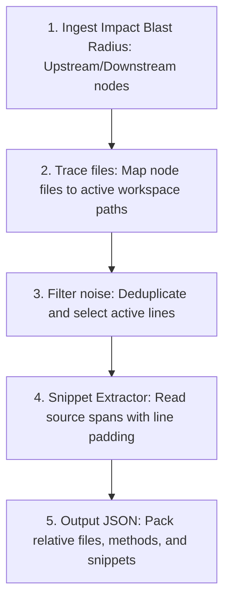

# Context Engine - Semantic Context Engine

This document details the architecture and payload packaging logic of the **AI Context Engine** (`src/context_engine/context_extractor.py`).

---

## The Context Reduction Pipeline

The Context Engine packages relevant files, functions, and active code snippets to build the minimal required context for AI agents:



### Diagram Description & Details

*   **Purpose**: Illustrates the step-by-step pipeline of context extraction, mapping raw impact nodes to a pruned, token-reduced prompt context.
*   **Components**:
    *   *Blast Radius Ingestion*: Pulls the upstream/downstream nodes compiled by the graph and impact engine.
    *   *Path Resolver*: Maps relative project paths inside the graph to physical file coordinates on disk.
    *   *Noise Filter*: Evaluates active code blocks and filters out unrelated segments.
    *   *Snippet Extractor*: Retrieves source code segments with custom boundary line padding.
    *   *JSON Packaging*: Compiles the final structured AI payload.
*   **Execution Flow**: Ingest Blast Radius ➔ Resolve physical file paths ➔ Filter out unimpacted code segments ➔ Extract line-padded function blocks ➔ Compile and export final JSON prompt structure.
*   **Important Notes**: Pruning achieves a 90%+ reduction in token bloat, preventing LLM context retrieval failures ("loss in the middle") and minimizing prompt costs.

---

## 1. Token Reduction Strategy

Traditional systems pass the entire contents of modified files (or the whole repository) to the LLM. The Context Engine uses **compiler-level AST boundaries** to significantly reduce tokens:
1.  **Scope Boundary Filtering**: Instead of sending the full 1,000-line controller file, the engine reads `start_line` and `end_line` of ONLY the impacted functions (e.g. `getAllUsers`).
2.  **Positional Line Padding**: Adds a standard padding of $\pm 5$ lines around the function span to preserve minor syntax details (e.g. decorators, imports) while discarding hundreds of unrelated helper methods.
3.  **High-fidelity Mapping**: Only files actively participating in the execution chain (linked by `ROUTE_CALL` or `FUNCTION_CALL`) are included. Orphan files are completely discarded.

This yields a **90%+ reduction in token bloat**, preserving the LLM's attention span and drastically lowering execution costs.

---

## 2. Extraction & Packaging Specification

### A. Inputs
The `extract_context(impact)` method ingests an impact dictionary compiled by the impact engine:
```json
{
  "target": "getAllUsers",
  "upstream": [
    {"from": {"type": "ROUTE", "route": "/users", "method": "GET"}}
  ],
  "downstream": [
    {"to": {"type": "FUNCTION", "file": "userService.js", "function": "fetchUsers"}}
  ]
}
```

### B. Traversal & Reading
1.  **Resolves Paths**: Translates relative graph paths into absolute file paths on the host system.
2.  **Extracts Functions**: Reads registered function line metrics (e.g. lines 12–45) inside active target files.
3.  **Applies Padding**: Pad lines to capture complete context:
    ```python
    start = max(1, func_data["start_line"] - 5)
    end = min(len(lines), func_data["end_line"] + 5)
    ```

### C. Output Payload Schema
Generates a strongly-structured, unified context payload ready for direct injection into AI prompts:
```json
{
  "relevant_files": [
    "controllers/userController.js",
    "services/userService.js"
  ],
  "relevant_functions": [
    {
      "name": "getAllUsers",
      "file": "controllers/userController.js",
      "start_line": 12,
      "end_line": 45
    }
  ],
  "code_snippets": [
    {
      "file": "controllers/userController.js",
      "function": "getAllUsers",
      "content": "function getAllUsers(req, res) {\n    const safeEmail = ...\n}"
    }
  ]
}
```
