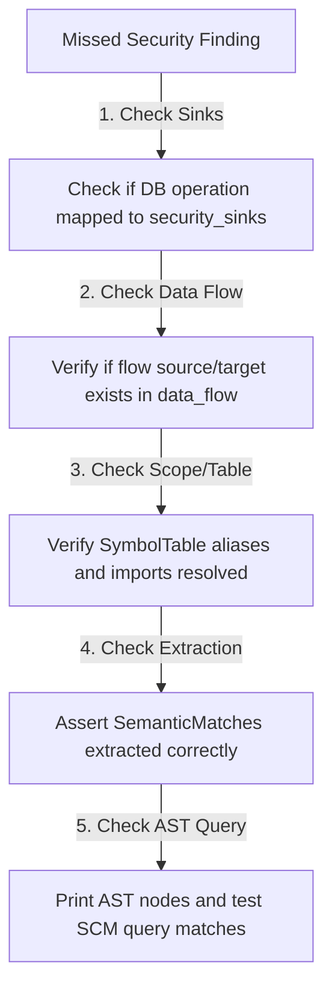

# Debugging Guide - Semantic Context Engine

This document provides a static analysis engineer's guide to troubleshooting common failures and debugging unexpected behaviors inside the Semantic Context Engine.

---

## Debugging Pipeline Failure Trace

If a security sink is missed or a data flow is incomplete, trace execution strictly backwards:

### Diagram Description & Details

*   **Purpose**: Outlines the troubleshooting pipeline trace to debug missing security findings or program flow gaps within the engine systematically.
*   **Components**:
    *   *Missed Security Finding*: The observed bug or validation failure.
    *   *Sinks Check*: Verifies database queries are successfully classified as sinks.
    *   *Data Flow Check*: Inspects variable propagation and parameter bindings.
    *   *Scope/Symbol Check*: Audits imported bindings and aliased modules.
    *   *Extraction Check*: Asserts SCM queries extract correct intermediate matches.
    *   *AST Query Check*: Inspects Tree-sitter AST nodes directly.
*   **Execution Flow**: Missed Finding ➔ Verify Sinks ➔ Audit Data Flow ➔ Check Symbol Table ➔ Assert Semantic Matches ➔ Inspect AST Nodes.
*   **Important Notes**: Prevents random guessing by tracing analysis failures backwards from output metrics directly to raw query syntax.

---

## Common Failures Reference

### 1. SCM Queries Not Matching
*   **Symptoms**: AST nodes are present, but the engine lists `Matches found: 0`.
*   **Root Causes**:
    *   The Tree-sitter query pattern in `src/queries/javascript.scm` is too strict or does not match the specific AST structure generated by the parser.
    *   Incorrect keyword or token identifier captures.
*   **How to Debug**:
    *   Construct a minimal test snippet in a scratch file.
    *   Use [check_output_for_tree.py](file:///c:/Users/ajeem/Downloads/downloads/CoderReviewAgent2/token_reducer_system/src/tests/check_output_for_tree.py) to print the complete Tree-sitter AST nodes with lines and types.
    *   Ensure query capture tags (e.g. `@call.func_name`) match exact node structures.

### 2. Missing `FUNCTION_PARAMS` SemanticMatch
*   **Symptoms**: Parameters exist in code, but `graph["parameters"]` is empty.
*   **Root Causes**:
    *   The capture engine classified the match as `UNKNOWN` instead of `FUNCTION_PARAMS`.
    *   This occurs if the query did not capture `function.name` directly (e.g., standard arrow parameters).
*   **How to Debug**:
    *   Assert `param.name` is present in the SCM query captures.
    *   Verify that `classify_match` inside `src/semantic_core/match_classifier.py` checks for `param.name` and correctly taxonomic-classifies it as `FUNCTION_PARAMS`.

### 3. Missing `FUNCTION_CALL` or `ROUTE_CALL` Execution Edge
*   **Symptoms**: Functions and calls are recorded in the graph, but `graph["execution_edges"]` is missing connections.
*   **Root Causes**:
    *   **Import Resolution Failure**: The caller invoked a module that cannot be resolved statically.
    *   **Function Index Gap**: The target callee was never registered in the `FunctionIndex` (e.g., if it is inside an ignored directory or has a syntax error).
*   **How to Debug**:
    *   Check `graph["imports"]` to ensure the module's relative path is correctly mapped.
    *   Verify that the target file path in `FunctionIndex` matches the resolved path on the disk.
    *   Trace logs inside `handle_call()` in `src/semantic_core/graph_builder.py` to check resolved file/function details.

### 4. Taint Propagation Gaps
*   **Symptoms**: Taint source (e.g. `req.body.email`) is recorded, but no security findings are emitted.
*   **Root Causes**:
    *   The variable assignment was marked `sanitized` due to a broad sanitizer function match (e.g. `normalizeEmail`).
    *   No positional data flow link connects the tainted source to the parameters of the database query function.
*   **How to Debug**:
    *   Check if `variable_states` has the variable flagged as `tainted: true`.
    *   Verify if `graph["data_flow"]` successfully links the source to the target function parameter.
