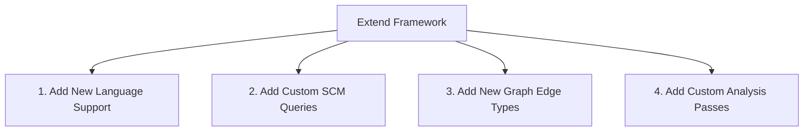

# Development Guide - Semantic Context Engine

This document provides developers with a step-by-step guide on how to extend and contribute to the static analysis engine.

---

## Extension Pipelines

Developers can extend the engine across four primary dimensions:



### Diagram Description & Details

*   **Purpose**: Outlines the clean extension pathways for static analysis developers to expand language support, query systems, graph structures, and security checks.
*   **Components**:
    *   *Add New Language*: Configures external Tree-sitter binaries and extensions.
    *   *Add SCM Queries*: Implements S-expression queries targeting AST nodes.
    *   *Add Graph Edges*: Mutual connections linking semantic components together in-graph.
    *   *Add Analysis Passes*: Integrates new custom data trackers and security audits.
*   **Execution Flow**: Extend Framework ➔ Select dimension (Language, Query, Edges, or Analysis Pass) ➔ Implement configuration ➔ Verify compiler correctness.
*   **Important Notes**: Modularity permits extending the engine with zero friction, protecting established AST parsing and compiler logic.

---

## 1. Adding a New Language Support (e.g. Go, Java)

To support a new language:
1.  **Install the Tree-sitter Language Package**: Add the dependency inside Python (e.g., `pip install tree-sitter-go`).
2.  **Update Language Config** (`src/language_config.py`):
    *   Import the new language module: `import tree_sitter_go as tsgo`.
    *   Register the extension, node tags, and parser instances in `LANG_CONFIG`:
        ```python
        ".go": {
            "LANGUAGE": Language(tsgo.language()),
            "FUNCTION_NODES": ["function_declaration", "method_declaration"],
            "MASTER_QUERY": GO_MASTER_QUERY
        }
        ```
3.  **Create Master Query file**: Add a query specification file at `src/queries/go.scm`.

---

## 2. Adding Custom SCM Queries

To capture a new AST pattern:
1.  Locate the corresponding SCM file under `src/queries/`.
2.  Write a Tree-sitter query matching the target node and tag it with semantic capture anchors (e.g. `@my_feature.name`):
    ```scm
    ; Capture Go goroutine calls
    (go_statement
      (call_expression
        function: (identifier) @call.goroutine_name)
    )
    ```
3.  Add classification mappings inside `src/semantic_core/match_classifier.py` if a new `SemanticMatch` classification tag is required.

---

## 3. Adding a New Graph Edge Type

To trace custom execution flows (e.g., `EVENT_EMITTER_FLOW`):
1.  Identify the match types to link (e.g. `EVENT_EMIT` and `EVENT_LISTEN`).
2.  Register the handler inside `GraphBuilder.build()` (e.g. `self.handle_event_emitter(sm)`).
3.  Inside the handler, invoke `self.add_execution_edge()` to compile the connection:
    ```python
    self.add_execution_edge(
        from_node={"type": "EVENT_EMIT", "event": event_name},
        to_node={"type": "EVENT_LISTEN", "file": listener_file},
        edge_type="EVENT_FLOW"
    )
    ```

---

## 4. Adding a New Vulnerability Analysis Pass

To audit new security vulnerabilities (e.g., Command Injection):
1.  **Define Sinks**: Add command execution wrappers (like `child_process.exec` or `subprocess.run`) to your monitored sinks dictionary inside `src/impact_engine/taint_traversal_engine.py`.
2.  **Define Sanitizers**: Index command escaping utilities.
3.  **Trace Propagation**: Run the traversal engine to propagate taints along inter-procedural data flows.
4.  **Emit Findings**: Add a new validation pass inside `detect_vulnerabilities()` mapping untrusted inputs to the new sinks.
