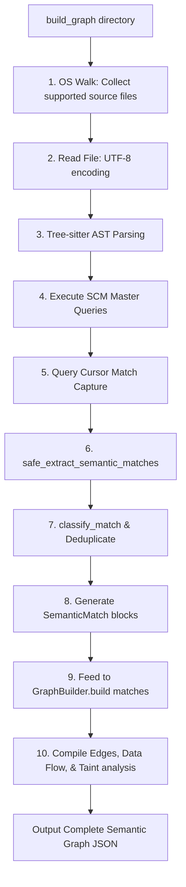

# Execution Flow - Semantic Context Engine

This document provides a highly detailed walkthrough of what happens when the Semantic Context Engine compiles a target codebase. It maps the end-to-end execution flow from a directory-level walk down to AST queries, match classification, and graph compilation.

---

## High-Level Execution Path

The diagram below outlines the full lifecycle of a standard compilation pass:



### Diagram Description & Details

*   **Purpose**: Details the step-by-step program execution flow from workspace ingestion to final AST parsing, query matching, extraction, and graph compilation.
*   **Components**:
    *   *OS Walk*: Traverses workspace folders, filtering out non-source directories.
    *   *AST Parsing*: Generates deep syntactical syntax trees using Tree-sitter.
    *   *SCM Query Engine*: Evaluates S-expressions over target AST nodes.
    *   *Match Extractor*: normalizes captured tokens and drops duplicate ranges.
    *   *Graph Builder Ingestion*: Traces imports, defines variables, and maps parameter flows.
*   **Execution Flow**: Workspace Walk ➔ AST Tree Parsing ➔ SCM Query Match Capturing ➔ SemanticMatch Range Filtering ➔ GraphBuilder edge linking and validation.
*   **Important Notes**: Range caching eliminates AST parsing duplicates, ensuring sub-50ms delta compilation times.

---

## Step-by-Step Code Walkthrough

### Step 1: Directory Traversal & Parsing (`src/build_graph.py`)
1.  **Directory Walking**: When `build_graph(directory)` is invoked inside `src/build_graph.py`, the engine walks the project folder:
    ```python
    for root, dirs, files in os.walk(directory):
        # Ignores folders listed in IGNORE_DIRS (venv, node_modules, etc.)
    ```
2.  **File Selection**: Files are checked against `LanguageManager.is_supported(ext)`. If supported (e.g. `.js`, `.py`), the file is read:
    ```python
    with open(abs_path, "r", encoding="utf-8") as f:
        content = f.read()
    ```
3.  **AST Tree Construction**: The raw content is parsed into a tree structure using Tree-sitter:
    ```python
    tree = parse_content(content, ext) # Calls parser.parse() internally
    ```

### Step 2: SCM Pattern Matching (`src/build_graph.py`)
1.  **Load Master SCM**: The engine retrieves the pre-defined language query spec (e.g., `src/queries/javascript.scm`):
    ```python
    query_string = langmanager.get_master_query(ext)
    query = Query(LANG_CONFIG[ext]["LANGUAGE"], query_string)
    ```
2.  **Run AST Matcher**: The `QueryCursor` is executed over the root node of the parsed AST to find specific captured patterns:
    ```python
    cursor = QueryCursor(query)
    matches = cursor.matches(tree.root_node)
    ```

### Step 3: Match Extraction & Deduplication (`src/semantic_core/match_extractor_fixed.py`)
1.  **Iterating Matches**: Matches are extracted in `safe_extract_semantic_matches()`:
    *   Tries to decode node captures into UTF-8 text.
    *   Classifies match types using `classify_match()`.
2.  **Duplicate Dropping**: If a match is classified as `CALL`, it checks if the start/end ranges already exist in the `seen_calls` set cache:
    ```python
    call_key = (capture_dict.get("call.start"), capture_dict.get("call.end"))
    if call_key in seen_calls:
        continue # Drop duplicate CALL matches
    ```
3.  **Scope Assignment**: Assigns immediate function owner scopes to non-declaration matches by calculating the smallest function range containing the match bytes:
    ```python
    if scope["start"] <= sm.start_byte and sm.end_byte <= scope["end"]:
        sm.owner_function = scope["name"]
    ```

### Step 4: Graph Compilation (`src/semantic_core/graph_builder.py`)
The matches are fed directly into `GraphBuilder.build(semantic_matches)`, which coordinates a multi-pass compilation sequence:
1.  **Pass 1 — Imports**: Ingests all `IMPORT` matches, registering them in `SymbolTable`.
2.  **Pass 2 — Symbol Aliases**: Maps variable aliasing (`SYMBOL_ALIAS`) and destructuring (`DESTRUCTURE_ALIAS`).
3.  **Pass 3 — Function Definitions**: Registers metadata, spans, and end lines in the `FunctionIndex`.
4.  **Pass 4 — Parameters**: Maps standard and destructured arguments to function definitions (falling back to `"GLOBAL_SCOPE"` where needed).
5.  **Pass 5 — Routes**: Integrates router endpoints with middleware and controller handlers.
6.  **Pass 6 — Calls**: Matches standard and destructured call targets with resolved functions and inserts `execution_edges`.
7.  **Pass 7 — Data Flow mapping**: Joins parameter arrays with arguments at call sites to construct `data_flow` lists.
8.  **Pass 8 — Taint & Return Analysis**: Traces taint sources, registers return values, and executes `propagate_return_taint()`.
