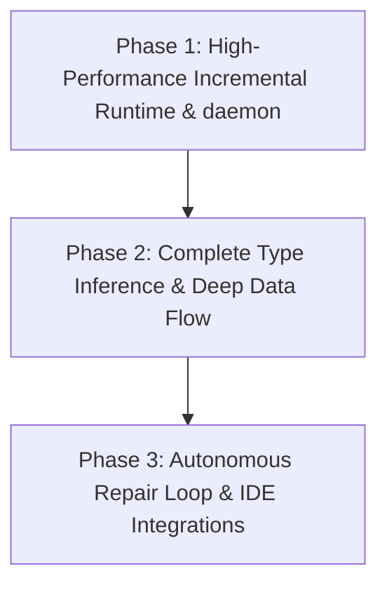

# Future Roadmap - Semantic Context Engine

This document outlines the multi-phase roadmap for extending the capabilities of the Semantic Context Engine static analysis platform.

---

## Roadmap Progression

The platform development is structured across three target phases:

### Diagram Description & Details

*   **Purpose**: Visualizes the roadmap progression of the Semantic Context Engine, charting transitions from raw compile optimization to type system expansion and autonomous AI agents.
*   **Components**:
    *   *Phase 1*: Focuses on file watchers, dirty node invalidators, and incremental daemons.
    *   *Phase 2*: Builds advanced type inference, Promise flows, and structured callbacks tracking.
    *   *Phase 3*: Integrates self-repairing loops, Z3 constraint solvers, and IDE extensions.
*   **Execution Flow**: Phase 1 (Optimization) ➔ Phase 2 (Static Typing & Deep Flows) ➔ Phase 3 (Self-Repair & Editor Plugins).
*   **Important Notes**: Protects core engine boundaries by optimizing infrastructure first before adding advanced AI interactions.

---

## Phase 1: High-Performance Incremental Engine (Daemon)

The core goal of Phase 1 is to transform the engine into a low-latency, background service:
1.  **Low-Latency File System Watchers**: Integrate direct OS-level event watches (like `watchdog`) to listen to file write events and automatically invalidates dirty AST branches.
2.  **Function-Level Invalidation**: Refine the invalidation engine to purge and re-stitch only individual modified functions rather than entire files.
3.  **Parallel Parsing Engine**: Implement a multi-processing parser pool in Python to walk and parse vast codebases concurrently, reducing full index compile times from seconds to milliseconds.

---

## Phase 2: Complete Type Inference & Advanced CFG

Phase 2 focuses on compiling highly sophisticated semantic graphs for complex modern syntaxes:
1.  **Static Type Inference**: Implement standard type-guessing heuristics to resolve symbol references on method calls without ambiguous duplicate matches.
2.  **Object Destructuring & Keyword Parameter Resolvers**: Update `build_argument_parameter_flow` to accurately map keyword arguments, rest parameters, and destructured parameter objects.
3.  **Dynamic Callback & Promise Flow Tracking**: Compile execution flows across JS Promises, async/await bindings, and standard callback scopes to prevent gaps in taint maps.

---

## Phase 3: Autonomous Repair & IDE Integrations

The long-term vision is a fully autonomous self-repair coding agent loop:
1.  **IDE Extension Integrations**: Build visual IDE extensions (such as VS Code or JetBrains plugins) that run the local Flask integration server. As the developer types, the extension displays the local change impact blast radius and flags newly introduced security taint risks instantly in the editor.
2.  **Self-Contained Autonomous Repair Engine**: Integrate LLM patch builders into the validation loop:
    *   The engine detects a taint path mapping to a SQL sink.
    *   An LLM is prompted to build a virtual patch adding a sanitizer wrapper.
    *   The engine simulates the patch via `PatchValidator`, parses the resulting virtual AST to verify syntactic correctness, and runs taint analysis again.
    *   If the taint is neutralized and no compilation errors exist, the patch is automatically committed back to git!
3.  **Cross-Language Bridge**: Extend Tree-sitter configurations to support cross-language dependencies (e.g. tracing a Python FastAPI route calling a Go microservice RPC).
