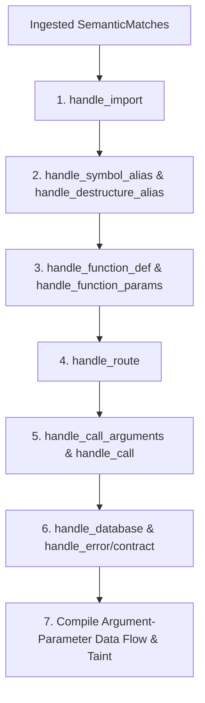

# GraphBuilder Guide - Semantic Context Engine

This document provides a comprehensive technical reference for the **GraphBuilder** engine (`src/semantic_core/graph_builder.py`). It explains every match handler, its purpose, inputs, outputs, and graph mutations.

---

## Ingestion Architecture

GraphBuilder coordinates multi-pass builds by executing selective iterations over extracted matches:



### Diagram Description & Details

*   **Purpose**: Represents the multi-pass match ingestion hierarchy inside GraphBuilder, converting isolated syntax matches into rich semantic links.
*   **Components**:
    *   *handle_import*: Compiles file imports and external packages mappings.
    *   *handle_symbol_alias*: Computes destructured renaming maps.
    *   *handle_function_def*: Formulates line coordinates for target helper methods.
    *   *handle_route*: Normalizes API routes and hooks them to controllers.
    *   *handle_call*: Resolves call sites and links caller-callee scopes.
    *   *handle_database*: Tracks database models, tables, and Mongoose sinks.
*   **Execution Flow**: Ingest Matches ➔ Parse Imports ➔ Resolve Aliases ➔ Index Functions ➔ Parse Routes ➔ Compile Call Sites ➔ Map DB Connections ➔ Trace Data Flow.
*   **Important Notes**: Strict ordering (imports first) ensures names are correctly bound before function invocations are parsed.

---

## Ingest Handlers Reference

### 1. `handle_import(sm)`
*   **Purpose**: Records module imports (ESM / CommonJS) and links external paths.
*   **Inputs**: `SemanticMatch` (type `IMPORT`).
*   **Graph Mutations**:
    *   Appends import alias and source to `self.graph["imports"][sm.file_path]`.
    *   Registers details in [SymbolTable](file:///c:/Users/ajeem/Downloads/downloads/CoderReviewAgent2/token_reducer_system/src/semantic_core/symbol_table.py).
*   **Example**:
    ```python
    self.graph["imports"]["api.js"].append({
        "source": "./controllers/userController",
        "name": "userController",
        "alias": "userController"
    })
    ```

### 2. `handle_function_def(sm)`
*   **Purpose**: Indexes function declarations and tracks code line spans.
*   **Inputs**: `SemanticMatch` (type `FUNCTION_DEF`).
*   **Graph Mutations**:
    *   Appends name, start line, and end line to `self.graph["functions"][sm.file_path]`.
    *   Registers function details in the `FunctionIndex`.
*   **Example**:
    ```python
    self.graph["functions"]["userService.js"].append({
        "name": "fetchUsers",
        "file": "userService.js",
        "start_line": 26,
        "end_line": 32
    })
    ```

### 3. `handle_function_params(sm)`
*   **Purpose**: Indexes formal function parameters.
*   **Inputs**: `SemanticMatch` (type `FUNCTION_PARAMS`).
*   **Graph Mutations**:
    *   Appends parameter names into function parameter lists inside `self.graph["parameters"][sm.file_path]`.
*   **Resolution Fallback**: Resolves function ownership using `sm.get("function.name") or sm.owner_function or "GLOBAL_SCOPE"`.
*   **Example**:
    ```python
    # Parameters for fetchUsers: ["email", "password"]
    self.graph["parameters"]["userService.js"].append({
        "function": "fetchUsers",
        "params": ["email", "password"]
    })
    ```

### 4. `handle_route(sm)`
*   **Purpose**: normalizes endpoints and routes execution flow to handlers/controllers.
*   **Inputs**: `SemanticMatch` (type `ROUTE`).
*   **Graph Mutations**:
    *   Appends normalized routes to `self.graph["routes"][sm.file_path]`.
*   **Execution Edges Emitted**:
    *   `ROUTE_CALL` edge linking `ROUTE` (e.g. `POST /login`) to the target controller `FUNCTION`.
    *   `ROUTE_MIDDLEWARE` edge linking `ROUTE` to intermediate `MIDDLEWARE` functions.

### 5. `handle_call(sm)`
*   **Purpose**: Resolves standard and destructuring call sites.
*   **Inputs**: `SemanticMatch` (type `CALL`).
*   **Graph Mutations**:
    *   Normalizes call objects and maps target functions via `SymbolTable` import resolution.
    *   Appends call data to `self.graph["calls"][sm.file_path]`.
*   **Execution Edges Emitted**:
    *   `FUNCTION_CALL` edge linking caller `FUNCTION` to callee resolved `FUNCTION` (if callee is a local function indexed inside the repository).

### 6. `handle_call_arguments(sm)`
*   **Purpose**: Collects expression parameters passed to function calls.
*   **Inputs**: `SemanticMatch` (type `CALL_ARGUMENTS`).
*   **Graph Mutations**:
    *   Extracts expression value and assigns call boundaries using `build_call_id()`.
    *   Appends argument values inside `self.graph["arguments"][sm.file_path]`.
*   **Resolution Fallback**: Falls back to `"GLOBAL_SCOPE"` if `sm.owner_function` is `None`.

### 7. `handle_database(sm)`
*   **Purpose**: Logs queries and Mongoose connections.
*   **Inputs**: `SemanticMatch` (type `DATABASE`).
*   **Graph Mutations**:
    *   Appends query values, connection object, and database models to `self.graph["database"][sm.file_path]`.
*   **Execution Edges Emitted**:
    *   `DB_ACCESS` edge linking caller `FUNCTION` to the target `DATABASE` (Mongoose) or `SQL` query.
