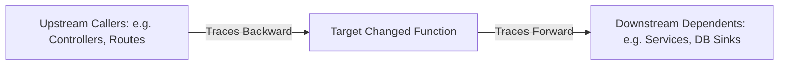

# Impact Analysis - Semantic Context Engine

This document details the mechanics and BFS traversal algorithms of the **Impact Analysis Engine** (`src/impact_engine/impact_analysis.py` and `src/impact_engine/graph_traversal.py`).

---

## 1. What is Blast Radius?

In large codebases, modifying a function can have wide-ranging cascading effects. The **Blast Radius** represents the set of all upstream components that invoke the changed function, and all downstream components that the changed function depends on:



### Diagram Description & Details

*   **Purpose**: Represents the bidirectional blast radius traversal path, computing downstream dependencies and upstream caller hierarchies from any target edit.
*   **Components**:
    *   *Target Changed Function*: The physical module or method that was edited.
    *   *Upstream Callers*: Traverses callers backward to locate exposed routes and controllers.
    *   *Downstream Dependents*: Traverses dependents forward to locate impacted database sinks or external service API calls.
*   **Execution Flow**: Detect Changed Target ➔ Traverse Upstream Execution Edges (Backward BFS) ➔ Traverse Downstream Execution Edges (Forward BFS) ➔ Compile Aggregate Blast Radius.
*   **Important Notes**: Bounded traversals prevent infinite recursion in mutual-recursive loops, providing precise, focused blast scopes.

By computing this blast radius deterministically, the Semantic Context Engine ensures that an AI agent receives not just the edited file, but the full lexical caller context, preventing cross-module breaking changes.

---

## 2. Traversal Algorithms

The graph traversal class (`GraphTraversal`) uses Breadth-First Search (BFS) over compiled `execution_edges`.

### A. Tracing Upstream Callers (`find_upstream_nodes`)
*   **Purpose**: Tracing backwards to locate all controllers or router endpoints that eventually invoke a target function.
*   **Logic**:
    1.  Enqueue the `target_node`.
    2.  While queue is not empty, dequeue `current`.
    3.  Loop through `execution_edges`. If `edge["to"]` matches `current`, then `edge["from"]` is an upstream caller.
    4.  Record the edge and enqueue `edge["from"]` to continue tracing recursively.
    5.  Uses a `visited` set to prevent infinite loops caused by circular dependencies.
*   **Code Reference**:
    ```python
    if self.node_equals(to_node, current):
        results.append({
            "edge_type": edge["type"],
            "from": from_node,
            "to": to_node
        })
        queue.append(from_node)
    ```

### B. Tracing Downstream Dependents (`find_downstream_nodes`)
*   **Purpose**: Tracing forwards to locate services, API calls, or database operations invoked by the target.
*   **Logic**:
    1.  Enqueue the `target_node`.
    2.  Loop through `execution_edges`. If `edge["from"]` matches `current`, then `edge["to"]` is a downstream dependent.
    3.  Record the edge and enqueue `edge["to"]`.

---

## 3. Impact Categories

The traversal engine categorizes nodes based on their semantic context:

1.  **ROUTE**: Represents an incoming HTTP endpoint (e.g. `POST /login`). If a route is linked to a changed controller, it is flagged as an impacted entrypoint.
2.  **FUNCTION**: A calling helper or class method.
3.  **DATABASE** / **SQL**: A database query boundary. If modified, this tracks data storage drifts.
4.  **MIDDLEWARE**: Security or auth filter.
