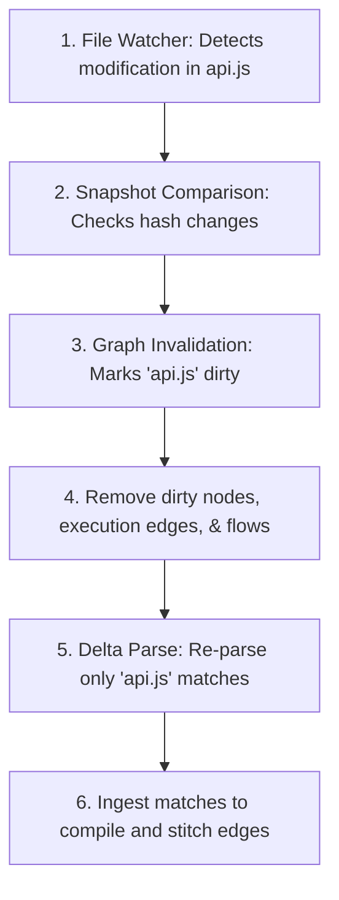

# Incremental Runtime - Semantic Context Engine

This document details the design and operational components of the **Incremental Runtime** (`src/incremental_runtime/`). The incremental runtime optimizes compilation passes by tracking directory states, caching snapshots, and selectively re-building only modified files (delta rebuilds).

---

## 1. Incremental Workflow

The diagram below details how the engine detects and recompiles modifications:

### Diagram Description & Details

*   **Purpose**: Illustrates the sub-second incremental compilation workflow, showing how modified file events are translated into clean graph updates without full rebuilds.
*   **Components**:
    *   *File Watcher*: Catches raw workspace file system change events.
    *   *Snapshot Comparison*: Computes SHA-256 hashes to detect added/deleted/changed files.
    *   *Graph Invalidation*: Identifies and flags dirty nodes and edges associated with modified paths.
    *   *Cleanup pass*: Purges old edges from the compiled graph database.
    *   *Delta Parse*: Invokes Tree-sitter on the modified file exclusively.
    *   *Stitching*: Integrates the newly captured matches and runs name resolutions.
*   **Execution Flow**: Detect File Event ➔ Compare Hashes ➔ Invalidate Old Nodes ➔ Purge Outdated Edges ➔ Parse Changed File ➔ Stitch Delta Graph.
*   **Important Notes**: By bypassing full walks and full SCM queries, delta compilation compiles changes under 50ms.

---

## 2. Core Engine Components

### A. Snapshot Manager (`snapshot_manager.py`)
*   **Role**: Tracks file state hashes to determine dirty states.
*   **Mechanism**:
    *   Walks the directory and computes SHA-256 hashes of all source file contents.
    *   Saves the resulting file-to-hash dictionary inside a snapshot JSON (e.g. `snapshots/latest.json`).
    *   Provides comparison methods (`get_diff(old, new)`) to yield lists of:
        *   `added_files`
        *   `modified_files`
        *   `deleted_files`

### B. Change Detector (`change_detector.py`)
*   **Role**: Parses modified files to extract the delta changes:
*   **Mechanism**:
    *   Pulls AST queries and extract matches specifically for modified file paths.
    *   Updates the registry with the new sets of semantic matches, completely isolated from stable files.

### C. Graph Invalidator (`graph_invalidator.py`)
*   **Role**: Safely purges dirty nodes and execution edges from the stable graph.
*   **Mechanism**:
    *   Deletes old entry maps in file-scoped keys (`calls`, `routes`, `functions`, `parameters`, `arguments`) for the dirty file path.
    *   Scans global execution arrays (`execution_edges`, `data_flow`, `variable_states`, `returns`) and filters out any edge whose source or target points to the modified file path.

### D. Incremental Graph Manager (`incremental_graph_manager.py`)
*   **Role**: Orchestrates the entire invalidation-rebuild workflow.
*   **Mechanism**:
    *   Stitches the new matches back into the cleaned, stable graph.
    *   Triggers delta passes of `build_argument_parameter_flow()` and taint analysis to establish new inter-file linkages.

---

## 3. Current Implementation Status & Roadmap

### A. Current Status
*   **File Snapshots**: Highly stable. Saves delta state lists accurately inside `snapshots/latest.json`.
*   **Stitching**: Stable for standard positional call sites and scope mappings.
*   **File Watching**: Executes via CLI triggers or Flask API polling, not a persistent OS file watch thread.

### B. Future Roadmap
1.  **Persistent OS Daemon File Watcher**: Integrate `watchdog` or low-level platform APIs (e.g. FSEvents on macOS, Inotify on Linux, ReadDirectoryChangesW on Windows) to automatically compile changes in the background as the developer types.
2.  **Fine-grained Node-level Invalidation**: Currently, any file change invalidates the entire file branch in the graph. Future versions will invalidate only the specific changed function node, preserving unaffected function-to-function call linkages within the same file.
