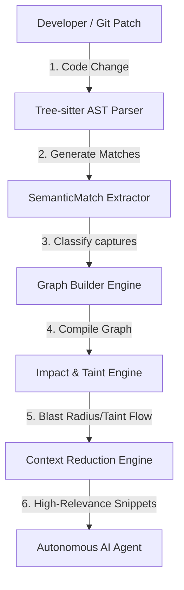

# Project Overview - Semantic Context Engine

The **Semantic Context Engine** is a compiler-grade static analysis and semantic graphing platform built using Tree-sitter. It operates as a high-fidelity local interpreter designed to map inter-procedural code execution flows, resolve symbols, track variable states, and perform precise taint propagation. 

Its ultimate goal is **Context Reduction**: extracting the mathematically minimal, high-relevance source code subset required for an AI agent to safely perform autonomous operations (such as code review or auto-repair) without exhausting LLM token windows or introducing noise.

---

## 1. Why the Project Exists & The Problem Solved

Software applications are large, multi-layered, and complex. Standard automated code review tools and RAG systems fail when reasoning about code changes for two main reasons:
1.  **Macro-scale Context Blindness**: An AI model looking at a single git diff does not know what upstream controllers depend on the changed function, or what downstream database schemas are impacted by it.
2.  **Token Bloat**: Passing an entire repository as context to an LLM is slow, expensive, and introduces "loss in the middle" retrieval failures.

The Semantic Context Engine solves this by compiling code files into a queryable **Semantic Graph**. Rather than guessing, the engine uses **compiler-grade AST matching and Control Flow Graph (CFG) analysis** to trace exact dependency chains, providing AI models with a pin-point precise slice of the repository relevant to any code change.

---

## 2. Developer-to-Agent Operational Lifecycle

The diagram below outlines the core execution workflow from a code edit to AI agent reasoning:

### Diagram Description & Details

*   **Purpose**: Outlines the developer-to-AI-agent execution lifecycle, showing how code changes flow through parsers, graphing compilers, and impact traversal engines to generate optimal context payloads.
*   **Components**:
    *   *AST Parser*: Constructs syntactical syntax trees using Tree-sitter.
    *   *Match Extractor*: normalizes captured tokens and matches semantic patterns.
    *   *Graph Builder*: Assembles multi-file linkages, imports, and execution edges.
    *   *Impact & Taint Engine*: Traces blast radii and untrusted data flow propagations.
    *   *Context Reduction Engine*: Slices line-padded function scopes to minimize prompt tokens.
*   **Execution Flow**: Developer Git Patch ➔ Ingest AST Parse ➔ Extract Semantic Match ➔ Build Semantic Graph ➔ Trace Blast Radius/Taints ➔ package Pruned Snippets ➔ Autonomous AI Agent.
*   **Important Notes**: By resolving scopes and name mappings deterministically, the LLM receives highly relevant context instead of a bloated raw repository view.

---

## 3. How It Differs From Other Systems

| Category | Semantic Context Engine | Vector Search / RAG | AI Code Review Tools |
| :--- | :--- | :--- | :--- |
| **Foundation** | Deterministic Tree-sitter AST & Linker | Fuzzy text embedding similarity | Pattern-matching heuristics / Direct LLM prompts |
| **Logic** | Exact, compiler-grade dependency graphs | Semantic string closeness | Prompt engineering wrappers |
| **Inter-file Flow** | Traces exact variable/parameter routes across files | Blind to import linkages or scope tables | Limited to single-file analysis |
| **Output Type** | Direct, deterministic code context reduction | Probabilistic keyword-relevant chunks | Generic, high-level review comments |

---

## 4. Core Philosophy & Long-Term Vision

*   **Zero Mocking, Zero Fuzzying**: Static analysis must be deterministic. If a parameter flows from a router to a model find query, it must be proved through exact symbol linkage, not vector search guesses.
*   **Minimal Payload, Maximum Relevance**: Tokens are a bottleneck. An AI agent is more efficient when given 50 lines of mathematically guaranteed relevant context than 10,000 lines of generic files.
*   **Target Users**: Software Engineering Agents, Autonomous Patch Builders, CI/CD Security Gatekeepers, and Static Analyzer Engineers.
*   **Vision**: Build an autonomous self-repair runtime where security vulnerabilities are analyzed, simulated, and repaired in real-time with zero human intervention.
