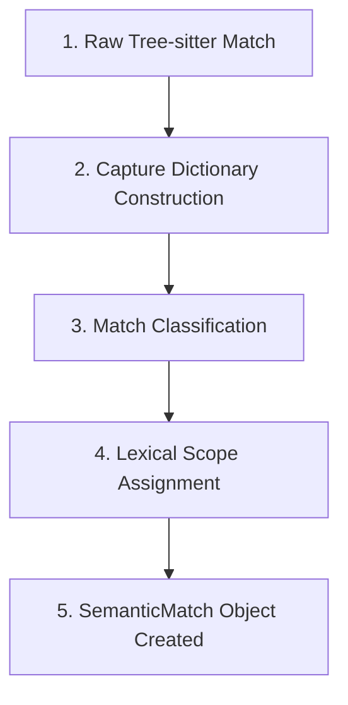

# SemanticMatch Guide - Semantic Context Engine

This document details the complete lifecycle and structural fields of the **SemanticMatch** model inside the Semantic Context Engine.

---

## 1. The SemanticMatch Lifecycle

A `SemanticMatch` represents a parsed AST node of interest. It goes through four stages of normalization before being ingested into the graph:



### Diagram Description & Details

*   **Purpose**: Outlines the complete extraction lifecycle of `SemanticMatch` tokens, normalizing raw Tree-sitter AST nodes into language-agnostic intermediate models.
*   **Components**:
    *   *Raw Tree-sitter Match*: Query results returned by Tree-sitter cursors.
    *   *Capture Dictionary*: Mapped raw string tokens decoded from UTF-8 buffers.
    *   *Match Classification*: Resolves AST taxonomies (e.g. `ROUTE`, `IMPORT`).
    *   *Lexical Scope Assignment*: Computes byte coordinates to nest variables and calls in parent scopes.
    *   *SemanticMatch*: Instantiates strongly-typed data structures representing compiler symbols.
*   **Execution Flow**: Capture raw match ➔ Build string dict ➔ Classify taxonomy ➔ Map parent function range ➔ Instantiate `SemanticMatch` object.
*   **Important Notes**: Range containment logic correctly resolves arrow methods, closures, and inner callbacks to their closest scope anchors.

1.  **Raw Match**: The `QueryCursor` returns match indices containing node captures.
2.  **Capture Dictionary**: Captures are decoded and organized into a string dictionary (e.g. `{"call.func_name": "escape", "arg.value": "email"}`).
3.  **Match Classification**: The signature classifier (`classify_match()`) assigns a high-level taxonomy (e.g., `CALL_ARGUMENTS`).
4.  **Lexical Scope Assignment**: Spans of `FUNCTION_DEF` matches are scanned. Any match whose byte range lies entirely inside a function definition gets its `owner_function` assigned.
5.  **Object Creation**: A `SemanticMatch` object is instantiated and appended to the extraction list.

---

## 2. SemanticMatch Structure & Fields

The class is defined in `src/semantic_core/semantic_match.py`. It holds raw details, ranges, and classification statuses:

*   **`match_type`** (str): The classified semantic category (e.g., `ROUTE`, `CALL`, `IMPORT`).
*   **`captures`** (dict): A dictionary of raw token text captured by query identifiers:
    *   Example: `{"assign.variable": "safeEmail", "assign.value": "escape(req.body.email)"}`
*   **`file_path`** (str): The absolute file path where the match was extracted.
*   **`owner_function`** (str / None): The immediate parent function containing this match (or `None` if it is global).
*   **`scope_id`** (str): Lexical scope identifier (defaults to `"GLOBAL"`).
*   **`start_byte`** (int): The starting byte position of the match in the source code.
*   **`end_byte`** (int): The ending byte position of the match in the source code.
*   **`start_point`** (tuple): 0-indexed line and column of the starting position: `(line, column)`.
*   **`end_point`** (tuple): 0-indexed line and column of the ending position: `(line, column)`.

---

## 3. Scope Assignment Resolution

Function scope ownership is resolved through range containment checks inside `src/semantic_core/match_extractor_fixed.py`. For every match `sm`:

```python
# Iterates through all detected function scopes
for scope in function_scopes:
    if scope["start"] <= sm.start_byte and sm.end_byte <= scope["end"]:
        size = scope["end"] - scope["start"]
        if size < best_size:
            best_size = size
            best_fit = scope["name"]
            
if best_fit:
    sm.owner_function = best_fit # Binds lexical parent function
```

This guarantees that nested arrow functions or helper methods are bound to their most immediate parent scopes.
