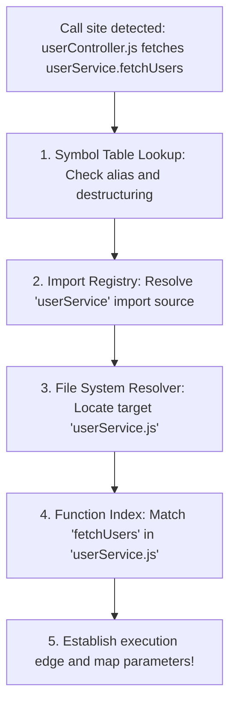

# Symbol Resolution - Semantic Context Engine

This document outlines the symbol resolution and linkage mechanisms inside the Symbol Table (`src/semantic_core/symbol_table.py`) and the Function Index (`src/semantic_core/function_index.py`).

---

## 1. Symbol Resolution Process

Symbol resolution enables the engine to link a function call in one file to its actual definition inside another file:



### Diagram Description & Details

*   **Purpose**: Details the complete symbol resolution and module linkage pipeline, mapping ambiguous local call sites to their absolute cross-module declarations.
*   **Components**:
    *   *Call Site Detection*: Captures function invocations in code.
    *   *Symbol Table Lookup*: Queries local scope variables, destructuring statements, and aliases.
    *   *Import Registry*: Translates modular dependencies into workspace paths.
    *   *File System Resolver*: Resolves relative path patterns to real disk paths.
    *   *Function Index*: Locates callee metadata inside target files.
*   **Execution Flow**: Call Site ➔ Local Symbol Lookup ➔ Resolve Import Statement ➔ Locate Target File ➔ Lookup Function Index ➔ Link Execution Edge.
*   **Important Notes**: Cross-file resolving processes imports, destructuring, and aliases recursively to locate true definitions in under 5ms.

---

## 2. Core Resolution Machinery

### A. Import Resolution
*   **Role**: Tracks where module imports point to on the file system:
*   **Implementation**: Inside `register_import()` and `resolve_import()`:
    *   Saves mappings of `file_path` -> `import_name` -> `import_source`.
    *   Resolves paths relatively (e.g. `./userService` in `C:/app/controllers/userController.js` resolves to `C:/app/services/userService.js`).
*   **Code Reference**:
    ```python
    # register_import() in symbol_table.py
    self.imports[file_path][import_name] = import_source
    ```

### B. Destructured Resolution
*   **Role**: Maps destructured declarations back to their parent import source (e.g. `const { fetchUsers } = require('./userService')` or `const { fetchUsers } = userService`):
*   **Code Reference**:
    ```python
    # register_destructured() in symbol_table.py
    self.destructured[file_path][local_name] = {
        "source": source_object # maps 'fetchUsers' back to 'userService'
    }
    ```

### C. Alias Resolution
*   **Role**: Resolves custom identifiers to their assigned variable values (e.g. `const service = userService; service.fetchUsers()` matches `service` to `userService`):
*   **Code Reference**:
    ```python
    # register_alias() in symbol_table.py
    self.aliases[file_path][(scope_id, alias_name)] = actual_name
    ```

### D. Inter-procedural Function Resolution
*   **Role**: Cross-references call targets with compiled definitions in `FunctionIndex`:
*   **Code Reference**:
    ```python
    # resolve_function() in function_index.py
    def resolve_function(self, file_path, function_name):
        return self.functions.get(file_path, {}).get(function_name)
    ```

---

## 3. Comprehensive Code Ingestion Example

Let's look at a dual-file compilation mapping:

#### File A: `controllers/userController.js`
```javascript
import { userService } from '../services/userService.js';

function getAllUsers(req, res) {
    const safeEmail = req.body.email;
    userService.fetchUsers(safeEmail, req.body.password);
}
```

#### File B: `services/userService.js`
```javascript
export function fetchUsers(email, password) {
    User.find({ email: email });
}
```

#### Ingestion Trace:
1.  `handle_import()` matches the import statement in `userController.js`, mapping `userService` -> `../services/userService.js`.
2.  `handle_function_def()` matches the definition in `userService.js`, registering `fetchUsers` inside the function index under `services/userService.js`.
3.  `handle_call()` matches the call `userService.fetchUsers()` in `userController.js`:
    *   Looks up the import source of `userService` (resolves to `services/userService.js`).
    *   Looks up `fetchUsers` in the function index for `services/userService.js` (successfully matches!).
    *   Emits a `FUNCTION_CALL` execution edge linking `getAllUsers` to `fetchUsers`.
