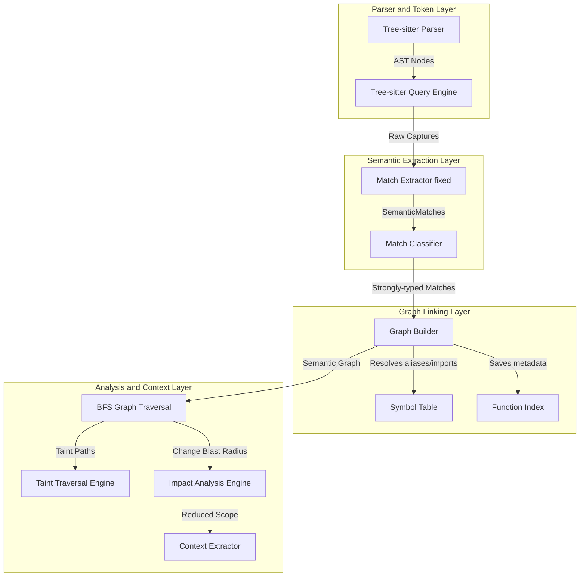
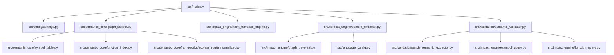

# System Architecture - Semantic Context Engine

This document maps out the complete, compiler-grade architecture of the Semantic Context Engine. The system is designed as a **decoupled, multi-layered static analysis pipeline** that transforms raw source code into a queryable semantic graph, performs taint and impact analysis, and packages AI context payloads.

---

## 1. High-Level Architecture Layers

The engine executes in a linear pipeline where each component has deterministic inputs and outputs:

### High-Level Layers Description & Details

*   **Purpose**: Represents the end-to-end multi-layered compilation and analysis pipeline of the Semantic Context Engine.
*   **Components**:
    *   *Parser and Token Layer*: Invokes Tree-sitter parsers and compiles master AST queries.
    *   *Semantic Extraction Layer*: Normalizes AST matches and isolates duplicate calls.
    *   *Graph Linking Layer*: Constructs execution graphs, indexes functions, and resolves symbols.
    *   *Analysis and Context Layer*: Propagates taints, traces blast radii, and packages token-reduced prompt payloads.
*   **Execution Flow**: Parse Source Code ➔ Match AST Queries ➔ Normalize Intermediate Matches ➔ Build Semantic Graph ➔ Run BFS sweeps and security checks ➔ Package prompt context.
*   **Important Notes**: By compiling code blocks to intermediate representations (`SemanticMatch`), the analysis passes are decoupled from raw language syntax differences.

---

## 2. Component Design & Responsibilities

### A. Parser & Query Layer (`src/language_config.py`)
*   **Role**: Handles high-performance Tree-sitter parsers (`tree-sitter-javascript`, `tree-sitter-python`) and loads master query specifications (`.scm` files) from `src/queries/`.
*   **Dependencies**: `tree_sitter`, external parser binaries.

### B. Semantic Extraction Layer (`src/semantic_core/`)
*   **`match_classifier.py`**: A fast, string-signature pattern classifier that maps query captures (like `assign.variable`, `return.value`) to strongly-typed matches.
*   **`match_extractor_fixed.py`**: Runs query captures, extracts raw token text, validates range bounds, and drops duplicate `CALL` matches using a range set cache `(start_byte, end_byte)`.

### C. Graph Compilation Layer (`src/semantic_core/graph_builder.py`)
*   **Role**: Coordinates the ingestion of `SemanticMatch` blocks and manages state machines for AST symbols:
    *   **Imports**: Saves ESM/CommonJS imports in the [Symbol Table](file:///c:/Users/ajeem/Downloads/downloads/CoderReviewAgent2/token_reducer_system/src/semantic_core/symbol_table.py).
    *   **Functions**: Registers signatures and scope spans in the [Function Index](file:///c:/Users/ajeem/Downloads/downloads/CoderReviewAgent2/token_reducer_system/src/semantic_core/function_index.py).
    *   **Flows**: Emits `execution_edges` (e.g. `ROUTE_CALL`, `FUNCTION_CALL`, `DB_ACCESS`) and compiles data flows (`data_flow` linking arguments to parameters).

### D. Analysis & Traversal Layer (`src/impact_engine/`)
*   **`graph_traversal.py`**: High-performance BFS orchestrator tracing forward (downstream dependents) and backward (upstream callers) paths.
*   **`taint_traversal_engine.py`**: Traces the exact propagation flow of untrusted user input (e.g. `req.body`) along compiled data flows to detect security vulnerabilities (e.g. `SQL_INJECTION`, `NOSQL_INJECTION`) in un-sanitized sinks.

### E. AI Context reduction Layer (`src/context_engine/`)
*   **`context_extractor.py`**: Traverses the graph from a targeted impact node, collects adjacent code snippets, filters out unrelated files, and outputs a highly compressed JSON payload for AI agent consumption.

---

## 3. Decoupled Core Dependency Chart

The diagram below details the strict module boundaries inside the `src/` active compiler system:

### Decoupled Core Dependency Description & Details

*   **Purpose**: Outlines the strict modular boundaries and direct import couplings inside the active compiler system.
*   **Components**:
    *   *main.py & server.py*: The CLI and Flask entrypoints driving the engine.
    *   *graph_builder.py*: The central compilation hub connecting symbol resolvers and indexers.
    *   *semantic_validator.py*: Runs patch syntax checks and validates variable taints.
    *   *context_extractor.py*: Pulls adjacent lines of code surrounding blast radius nodes.
*   **Execution Flow**: CLI Entrypoint ➔ Ingest Configs ➔ Parse files with LanguageManager ➔ Build Graph with GraphBuilder ➔ Extract context ➔ Validate syntax constraints.
*   **Important Notes**: Isolating core algorithms (traversals, resolvers) in distinct packages guarantees that the engine compiles cleanly with zero circular dependencies.
