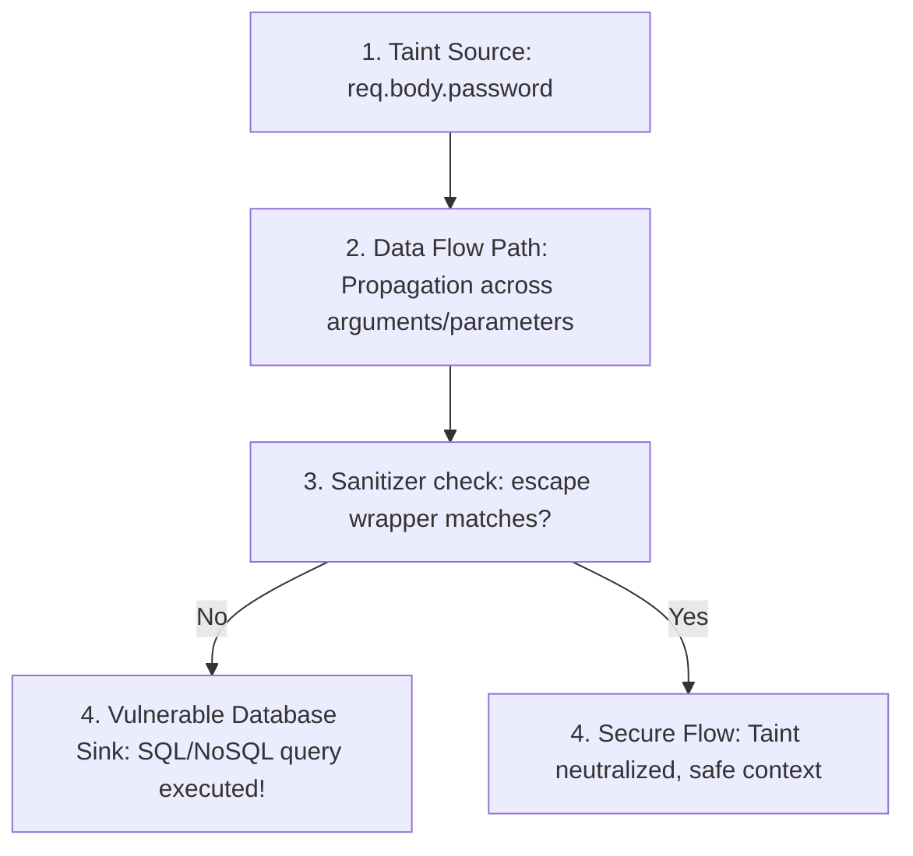

# Taint Analysis - Semantic Context Engine

This document details the architecture and operational rules of the **Taint Analysis Engine** (`src/impact_engine/taint_traversal_engine.py`). Taint analysis dynamically propagates untrusted source states along data flow edges to detect security vulnerabilities at sensitive sink locations.

---

## Taint Propagation Lifecycle

Taint analysis operates across four core static analysis models:



### Diagram Description & Details

*   **Purpose**: Illustrates the security taint propagation lifecycle, tracking untrusted parameter flow to sensitive sinks and checking sanitizer functions.
*   **Components**:
    *   *Taint Source*: The entrypoint where untrusted inputs (e.g. `req.body`) enter the application.
    *   *Data Flow Path*: The inter-procedural propagation steps linking variables to callee arguments and parameters.
    *   *Sanitizer Check*: Assesses if escaping or formatting utilities wrap the variables in active scopes.
    *   *Vulnerable Database Sink*: Un-sanitized SQL or NoSQL Mongoose queries.
    *   *Secure Flow*: Taints cleared and sanitized by compiler validations.
*   **Execution Flow**: Ingest Source ➔ Trace Data Flow ➔ Check Sanitizers ➔ If un-sanitized, reach Sinks ➔ Flag security findings.
*   **Important Notes**: The engine checks try/catch protections and sanitizer signatures per scope before tracing execution edges to database connection objects.

---

## 1. Taint Sources (`detect_taint_sources`)

Taint sources represent entry points of untrusted user input.

### A. Core HTTP Inputs (Express-specific)
Any expression/variable starting with the following prefixes is classified as a `USER_INPUT` taint source:
*   `req.body`
*   `req.query`
*   `req.params`
*   `req.headers`

*   **Structure**:
    ```json
    {
      "type": "USER_INPUT",
      "file": "userController.js",
      "source": "req.body.password",
      "target_function": "fetchUsers",
      "target_param": "password"
    }
    ```

### B. Propagation Returns (`propagate_return_taint`)
If a function returns a value that can be mapped to an incoming tainted parameter, the return site is flagged as a `RETURN_TAINT` source.

---

## 2. Security Sinks (`detect_security_sinks`)

Sinks represent sensitive system boundaries where executing untrusted code leads to vulnerabilities.

### A. SQL Query Sinks
*   **Trigger**: Member calls using `query` or `execute` on database connection objects (e.g. `db.query("...")`).
*   **Vulnerability Risk**: `SQL_INJECTION` (High Severity).

### B. NoSQL / Mongoose Sinks
*   **Trigger**: Member calls on database models using typical query verbs:
    *   `find`, `findOne`, `create`, `updateOne`, `updateMany`, `deleteOne`, `aggregate`.
*   **Vulnerability Risk**: `NOSQL_INJECTION` (High Severity).

---

## 3. Sanitizers (`detect_sanitizers`)

Sanitizers are safety wrappers that neutralize taint flags.
*   **Monitored Functions**:
    *   `escape`
    *   `sanitize`
    *   `normalizeEmail`
    *   `xss`
*   **Logic**: If a call to a sanitizer is captured within the same function scope as the tainted variable assignment, the taint status is cleared:
    ```python
    # track_variable_states in graph_builder.py
    for sanitizer in sanitizer_functions:
        if sanitizer in value:
            sanitized = True
            tainted = False
    ```

---

## 4. Traversals & Findings (`detect_vulnerabilities`)

1.  **Iterates Taints**: The engine traverses the list of `taint_sources`.
2.  **Verifies Sanitization**: If a sanitizer function has been invoked inside the caller scope, the traversal is skipped (secure flow).
3.  **Traces CFG**: If un-sanitized, the engine traces `execution_edges` to find if a caller `FUNCTION` maps to a downstream database sink (`DB_ACCESS`).
4.  **Emits Findings**: If a path is traced successfully, it appends a security finding:
    ```json
    {
      "type": "NOSQL_INJECTION",
      "severity": "HIGH",
      "source": "req.body.password",
      "sink": "find",
      "model": "User",
      "target_function": "fetchUsers"
    }
    ```
