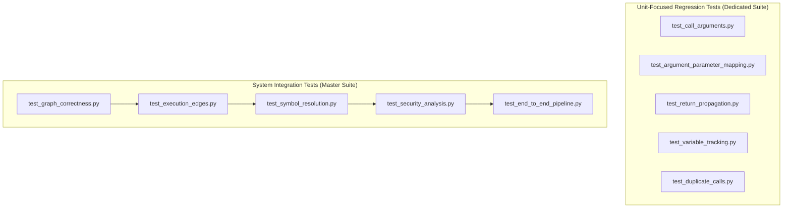

# Testing Guide - Semantic Context Engine

This document provides a developer guide for writing, running, and debugging tests in the Semantic Context Engine.

---

## 1. Test Architecture

The repository divides tests into two distinct levels to ensure both unit-level accuracy and system-wide integration:



### Diagram Description & Details

*   **Purpose**: Outlines the dual-focused testing hierarchy, dividing checks between isolated unit-level regression tests and master integration pipelines.
*   **Components**:
    *   *Unit-Focused Regression Tests*: Exercises specific engine fixes (such as arguments, returns, and variable tracking) using isolated text snippets.
    *   *System Integration Tests*: Runs the complete compiler and resolver end-to-end against the physical `test_microservice` code.
*   **Execution Flow**: Unit-Focused Regression Suite ➔ System Integration Suite ➔ Master Test Runner Aggregator ➔ Summary report.
*   **Important Notes**: UTF-8 encoding variables must be set inside PowerShell terminals before execution on Windows to ensure strict character compatibility checks.

---

*   **Dedicated Suite**: Tests specific compiler fixes (such as global scopes, return mapping, and deduplication) using highly focused, isolated code snippets.
*   **Master Integration Suite**: Tests the complete engine end-to-end on the real [test_microservice](file:///c:/Users/ajeem/Downloads/downloads/CoderReviewAgent2/token_reducer_system/test_microservice) project.

---

## 2. Running the Test Suite

Tests must be executed using the workspace's virtual environment Python interpreter under a forced UTF-8 encoding environment variable on Windows PowerShell to ensure block characters do not fail CP1252 parsing.

### A. Run Master Suite (`run_all_tests.py`)
Executes all 5 system integration tests and prints a unified status summary:
```powershell
# Run from within src/tests/
$env:PYTHONIOENCODING="utf-8"; & "..\..\.venv\Scripts\python.exe" run_all_tests.py
```

### B. Run Dedicated Unit Tests
Executes individual regression tests:
```powershell
# Example: Run Return Propagation test
$env:PYTHONIOENCODING="utf-8"; & "..\..\.venv\Scripts\python.exe" test_return_propagation.py
```

---

## 3. Creating a New Regression Test

To write a new dedicated test:
1.  Create a file under `src/tests/` prefixed with `test_` (e.g. `test_my_feature.py`).
2.  Define a string representation of the source code to parse.
3.  Load the parser and SCM queries:
    ```python
    lm = LanguageManager()
    parser = lm.get_parser(".js")
    query_string = lm.get_master_query(".js")
    query = Query(LANG_CONFIG[".js"]["LANGUAGE"], query_string)
    ```
4.  Parse and feed matches to `safe_extract_semantic_matches()` and `GraphBuilder()`:
    ```python
    tree = parser.parse(bytes(code, "utf-8"))
    cursor = QueryCursor(query)
    matches = list(cursor.matches(tree.root_node))
    semantic_matches = safe_extract_semantic_matches(matches, "test.js", tree)
    
    builder = GraphBuilder()
    graph = builder.build(semantic_matches)
    ```
5.  Execute assertions against `graph` values.
