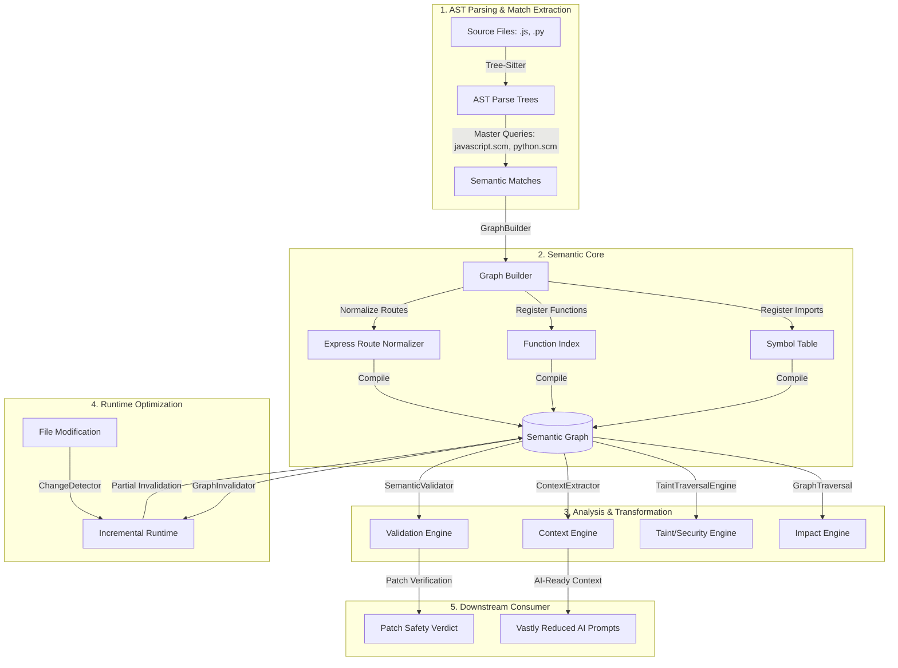

# Token Reducer & Semantic Context Engine: Project Deep-Dive

Welcome to the comprehensive architecture and technical guide for your **Token Reducer & Semantic Context Engine**. This system is an advanced static analysis framework designed to parse source code, build a semantic graph of execution and data-flow, perform security taint analysis, and extract minimal, high-value context to optimize AI model prompts (reducing tokens significantly).

---

## 🏗️ Central System Architecture

The core philosophy of the engine is to **replace brute-force code loading** (sending entire files to an LLM) with **semantic dependency tracking**. Below is a visual representation of how the engine ingests code, builds the semantic graph, performs impact and taint analysis, and validates changes.



---

## 📁 Component-by-Component Walkthrough

### 1. `semantic_core/` (The Parser and Graph Builder)
This is the heart of the engine. It transforms raw text into a structured, highly relational graph.

*   **`language_config.py`**: Configures the AST parsers (`tree-sitter-javascript`, `tree-sitter-python`) and associates files with their master tree-sitter query configurations.
*   **`queries/` (`javascript.scm`, `python.scm`)**: Tree-sitter query files written in Scheme-like patterns. They query the AST for specific patterns of interest:
    *   Imports and requires (e.g. `import_statement`, `require` calls).
    *   Express/network routes (e.g. `router.get(...)`).
    *   Taint sources (e.g. `req.body`, `req.query`).
    *   Security/database sinks (e.g. Mongoose `find`, SQL `query`).
    *   Functions, parameters, assignments, destructuring, returns, and errors.
*   **`match_extractor_fixed.py`**: Utilizes the tree-sitter queries to extract semantic patterns, assigns scope IDs, and hooks up the correct parent scopes (e.g. linking nested blocks to their containing function).
*   **`symbol_table.py`**: Tracks variables, imports, destructuring structures, and aliases. It maps symbol identifiers back to their original file source or library scope (e.g., resolving `userController` back to `controllers/userController.js`).
*   **`function_index.py`**: An index of all registered functions, their physical location (start and end line), and metadata.
*   **`frameworks/express_route_normalizer.py`**: Special-purpose normalization for Express JS APIs. It parses middlewares and maps route definitions directly to their controller handlers.
*   **`graph_builder.py`**: Combines matches across all files to build a unified system-level graph. The graph maps:
    *   **Imports** & **Routes**
    *   **Function Definitions** & **Call Sites**
    *   **Execution Edges** (links between routes, controllers, services, database operations)
    *   **Taint Sources**, **Sanitizers**, and **Sinks**

---

### 2. `impact_engine/` (Relationship Tracing & Flow Analysis)
This engine answers questions about "what happens upstream or downstream if a line of code changes."

*   **`graph_traversal.py`**: Traverses execution edges upstream (who calls me?) and downstream (who do I call?). This is crucial for pinpointing regression impacts.
*   **`taint_traversal_engine.py`**: Performs DFS/BFS on the graph's execution edges specifically seeking paths from user input sources (e.g., `req.body.password`) to database sinks (e.g. `User.find()`). It validates whether such paths pass through intermediate sanitizers (e.g., `validator.escape()`).

---

### 3. `context_engine/` (AI Prompt Optimization)
This translates dry graph data into minimal, highly relevant text blocks that are safe and concise for LLMs.

*   **`context_extractor.py`**: Reads an impact analysis result and extracts only the source code lines of the *actual* functions involved in the impact chain. Rather than sending the entire `userController.js` and `userService.js`, it only pulls `getAllUsers()` and `fetchUsers()`.
*   **`review_generator.py`**: Compiles these snippets and execution chains into review summaries suitable for automated code reviews.

---

### 4. `incremental_runtime/` (Caching and Performance)
To handle enterprise codebases containing thousands of files, full graph rebuilds are avoided.

*   **`snapshot_manager.py`**: Save and load the semantic graph states in JSON formats.
*   **`change_detector.py`**: Uses cryptographic hashing and metadata checks to recognize which files changed since the last build.
*   **`graph_invalidator.py`**: Selectively removes only the nodes and edges belonging to updated/deleted files and forces incremental rebuilds of only those specific files.

---

### 5. `validation/` (Change & Patch Trust Assessment)
Ensures generated code changes or incoming PRs do not break semantic invariants.

*   **`patch_semantic_extractor.py`**: Evaluates git-style patches to identify added lines, declared variables, and new assignments.
*   **`semantic_validator.py`**: Runs checks on patches:
    *   **Unknown Identifier Check**: Alerts if a patch calls a function or uses a variable that does not exist in the codebase graph.
    *   **Taint Safety Validation**: Assesses if a patch interacts with or leaks unescaped/tainted user parameters.

---

## 🧪 Real-World Verification: `test_microservice/`

The robustness of this engine is actively verified against a real, fully realized Node.js microservice (`test_microservice`). 

### Microservice Architecture:
```
test_microservice/
├── api.js                   # Express Router (defines endpoints & hooks middlewares)
├── controllers/
│   └── userController.js    # Ingests user input (safe email via escape, raw password)
└── services/
    └── userService.js       # Performs DB query on User model
```

### The Call Chain:
```
Route(GET /users) ──> Function(getAllUsers) ──> Function(fetchUsers) ──> Database(User.find)
```

### The Real Vulnerability Tracked:
1. **Taint Source**: `req.body.password` in `userController.js` (unvalidated/unsanitized).
2. **Sanitization**: `validator.escape()` is applied only to `req.body.email` (stored in `safeEmail`).
3. **Propagation**: `req.body.password` is passed cleanly into `userService.fetchUsers(email, password)`.
4. **Taint Sink**: `fetchUsers` executes `User.find({ password: password })` without sanitization.
5. **Detection**: `TaintTraversalEngine` traces this specific chain and marks it as a `TAINT_FLOW` with `HIGH` severity.

---

## 🚀 Running the Verification Suite

All 5 core engine verification files run on the real project files (no mocks!).

To execute them without Windows-encoding issues (due to ASCII block graphics in terminal logs), set the environment variable encoder to UTF-8:

```powershell
# Set console encoding to UTF-8
$env:PYTHONIOENCODING="utf-8"

# Navigate to the test suite
cd src/tests

# Run the master test runner
& "..\.venv\Scripts\python.exe" run_all_tests.py
```

### Test Coverage Highlights:
*   `test_graph_correctness.py`: Asserts AST parsing correctly identifies ESM imports, active controllers, database operations, and function scopes.
*   `test_execution_edges.py`: Asserts that the full multi-tier edge chain `Route -> Controller -> Service -> Database` is completely linked.
*   `test_symbol_resolution.py`: Asserts that local and external symbols are either successfully resolved or properly classified as `UNRESOLVED` (e.g. `authController.login`).
*   `test_security_analysis.py`: Verifies taint sources, database sinks, and identifies the raw password vulnerability chain.
*   `test_end_to_end_pipeline.py`: Validates the continuous pipeline from AST ingestion to impact analysis and validation.
