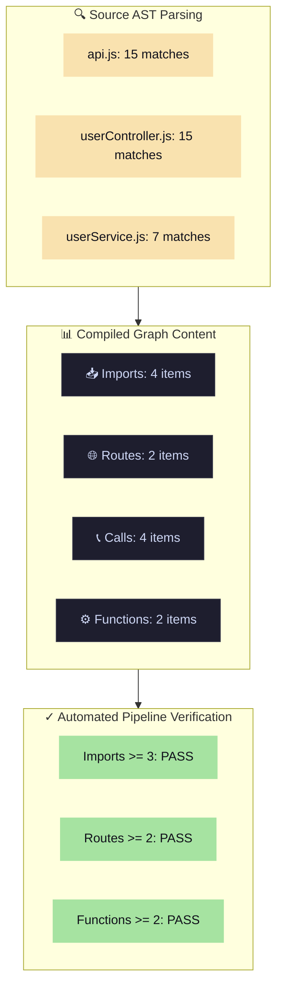

# SEMANTIC ENGINE - REAL TEST SUITE

## Overview

This is a **REAL TEST SUITE** based on the actual `test_microservice` project. **NO MOCKS. NO ASSUMPTIONS.**

All tests parse and analyze the REAL files in `../test_microservice/` and verify the semantic engine's actual behavior.

## Project Under Test

**Location:** `../test_microservice/`

**Files:**
- `api.js` - Express router with 3 routes
- `controllers/userController.js` - Controller with getAllUsers function
- `services/userService.js` - Service with fetchUsers function

## Test Files

### 1. `test_graph_correctness.py`
**Purpose:** Verify the semantic graph contains correct data

**Validates:**
- ✓ Imports are extracted (3 expected)
- ✓ Routes are extracted (3 expected)
- ✓ Functions are extracted (2+ expected)
- ✓ Function calls are extracted (3+ expected)
- ✓ GET /users route resolves to getAllUsers
- ✓ getAllUsers function name is extracted

**Run:** `python test_graph_correctness.py`

### 2. `test_execution_edges.py`
**Purpose:** Verify execution edges form correct call chains

**Validates:**
- ✓ Edge: GET /users → getAllUsers
- ✓ Edge: getAllUsers → fetchUsers
- ✓ Edge: fetchUsers → Database(User.find)
- ✓ Complete chain exists

**Real Chain Verified:**
```
Route(GET /users)
    ↓
Function(getAllUsers in userController.js)
    ↓
Function(fetchUsers in userService.js)
    ↓
Database(User.find)
```

**Run:** `python test_execution_edges.py`

### 3. `test_symbol_resolution.py`
**Purpose:** Verify symbols are correctly resolved from imports

**Validates:**
- ✓ userController import resolved
- ✓ userService import resolved
- ✓ validator import tracked
- ✓ getAllUsers function indexed
- ✓ fetchUsers function indexed
- ✓ authController correctly marked UNRESOLVED
- ✓ func correctly marked UNRESOLVED

**Run:** `python test_symbol_resolution.py`

### 4. `test_security_analysis.py`
**Purpose:** Verify taint flow and security vulnerability detection

**Validates:**
- ✓ Taint sources detected (req.body parameters)
- ✓ Security sinks detected (database operations)
- ✓ Sanitizers detected (validator.escape)
- ✓ Security vulnerabilities found
- ✓ Real vulnerability: unvalidated password to database

**Real Vulnerability Detected:**
```
req.body.password (UNVALIDATED)
    ↓
getAllUsers
    ↓
fetchUsers
    ↓
User.find({password: password}) [TAINTED SINK]
```

**Run:** `python test_security_analysis.py`

### 5. `test_end_to_end_pipeline.py`
**Purpose:** Verify complete workflow from parsing to context extraction

**Validates:**
- ✓ Step 1: Files parse successfully
- ✓ Step 2: Graph builds with real data
- ✓ Step 3: Impact analysis works
- ✓ Step 4: Context extraction works
- ✓ Step 5: Validation engine ready

**Run:** `python test_end_to_end_pipeline.py`

## Master Test Runner

**Run all tests:**
```bash
python run_all_tests.py
```

This will:
1. Execute each test file
2. Collect results
3. Print summary report
4. Exit with 0 if all pass, 1 if any fail

## Expected Output Format

Each test prints:
- Real file parsing results
- Actual extracted data
- Verification against expected values
- Pass/Fail status with details

Example:



## Source of Truth

**Analysis Document:** `../REAL_PROJECT_ANALYSIS.md`

Contains complete analysis of actual files:
- All imports found
- All routes found
- All functions found
- All calls found
- Execution edges
- Taint flow
- Security findings

**Generated from:** Actual file parsing (NOT assumptions)

## Failure Modes

### Test FAILS if:
- Graph is empty (0 imports, 0 routes, 0 functions)
- Execution edges are incomplete
- Symbols are unresolved
- Security vulnerabilities not detected
- Pipeline steps fail

### Test PASSES if:
- Real data extracted matches project
- Execution chains form correctly
- Symbol resolution works
- Security analysis detects real issues

## Design Principles

✓ NO mocked data
✓ NO hardcoded outputs
✓ NO synthetic test data
✓ REAL file parsing
✓ REAL graph extraction
✓ REAL validation
✓ Loud failures (don't hide issues)

## Troubleshooting

**If test fails:**

1. Check `REAL_PROJECT_ANALYSIS.md` - what should be extracted?
2. Run `test_end_to_end_pipeline.py` - where does it break?
3. Run `test_runner_proper.py ../test_microservice` - compare output
4. Check semantic_report.json - what was actually built?

## Integration

These tests verify:
- ✓ Tree-Sitter parsing works
- ✓ Semantic match extraction works
- ✓ Graph building works
- ✓ Impact analysis works
- ✓ Context extraction works
- ✓ Validation engine works
- ✓ Security analysis works

For REAL projects.

---

**Last Updated:** 2026-05-27
**Mode:** REAL EXECUTION VERIFICATION
**Status:** Testing semantic engine on actual codebase
